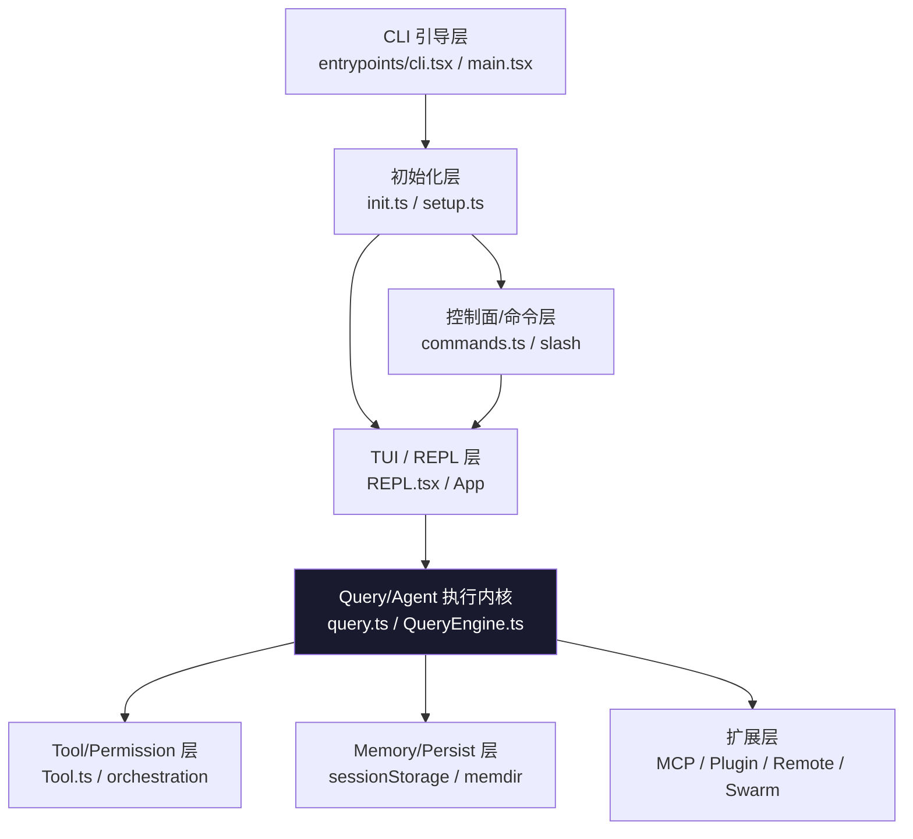

# 第 1 章：软件架构与程序入口

## 本章信息

| | |
|--|--|
| **本章目标** | 理解 Claude Code 的整体分层架构和程序启动链路 |
| **适合读者** | 所有读者，建议作为第一章阅读 |
| **前置知识** | 基本的 TypeScript 和 Node.js 概念 |
| **核心结论** | Claude Code 是六层分层的本地 Agent 平台，多种运行形态共用同一套执行内核 |

---

## 核心结论

**这个项目不是命令行聊天程序，而是一套本地 Agent 平台。**

采用"CLI 引导层 → TUI/REPL 交互层 → Query/Agent 执行内核 → Tool/Permission 层 → Memory/Persistence 层 → MCP/Remote/Swarm 扩展层"的六层分层结构。

---

## 总体架构图

### 分层架构



### 默认交互主链路

```
entrypoints/cli.tsx
  → main.tsx
  → init.ts + setup.ts（分阶段初始化）
  → launchRepl()
  → App + REPL.tsx
  → PromptInput / slash command
  → query()
    → services/api/claude.ts（调用模型 API）
    → runTools() / StreamingToolExecutor（执行工具）
    → sessionStorage / SessionMemory / compact（持久化）
    → 返回到 query 主循环
```

---

## 程序入口详解

### 1.1 轻量入口：`cli.tsx` 做早期分流

**文件**：`src/entrypoints/cli.tsx`

这一层是"入口分流器"，不是完整应用。职责是识别快路径并提前退出，避免启动完整 React/Ink 应用。

```typescript
// 结构伪代码
async function main() {
  const argv = parseArgs(process.argv)

  // 快路径分流 —— 命中则执行并退出
  if (argv['--version'])         { console.log(version); process.exit(0) }
  if (argv['--dump-system-prompt']) { await dumpSystemPrompt(); process.exit(0) }
  if (argv['remote-control'])    { return runRemoteControl(argv) }
  if (argv['daemon'] || argv['bg'] || argv['runner']) {
    return runDaemonOrBackground(argv)
  }

  // 兜底：进入完整主启动器
  await import('./main.tsx').then(m => m.main(argv))
}
```

**设计价值**：普通快速命令不需要加载整个应用（React、Ink、MCP 等），启动速度快。

---

### 1.2 主启动器：`main.tsx` 是系统编排中心

**文件**：`src/main.tsx`

`main.tsx` 是总控入口，负责所有主路径初始化，从其 import 列表可以直接推断职责：

- 初始化（`init.ts`）
- Bootstrap 配置拉取（`services/api/bootstrap.ts`）
- MCP 工具加载（`services/mcp/client.ts`）
- 工具池组装（`tools.ts`）
- Agent 定义加载（`tools/AgentTool/loadAgentsDir.ts`）
- Skills 初始化（`skills/bundled/index.ts`）
- 遥测初始化（trust 后才启动）
- 配置热更新监听

**主流程**：

```typescript
export async function main(argv) {
  await init(argv)              // trust 前初始化
  const permissionMode = initialPermissionModeFromCLI(argv)
  const model = resolveModel(argv)

  // 条件分支
  if (argv['--print'] || argv['--sdk']) return runHeadless(...)
  if (argv['bridge'])                   return runBridge(...)
  if (argv['remote'])                   return runRemote(...)

  // 默认路径：完整运行时
  const bootstrap = await fetchBootstrapData()
  const mcpTools  = await getMcpToolsCommandsAndResources()
  const tools     = getTools(permissionContext)
  const skills    = initBundledSkills()
  const agents    = getAgentDefinitionsWithOverrides()

  await initializeTelemetryAfterTrust()   // trust 后才发遥测
  settingsChangeDetector.start()          // 热更新监听

  await launchRepl(root, appProps, replProps, renderAndRun)
}
```

---

### 1.3 初始化层：`init.ts` 与 `setup.ts` 的职责分离

| 文件 | 职责 | 时机 |
|------|------|------|
| `init.ts` | 逻辑初始化（证书、HTTP、遥测骨架） | trust 建立前 |
| `setup.ts` | 环境初始化（CWD、hooks、memory 启动） | 进入 REPL 前 |

**为什么要分离**：trust 建立前只应用安全的环境变量，防止"配置文件本身是攻击面"的风险（见 `@include` 深度限制）。

---

## 四种运行形态

### REPL/TUI 形态（默认）

```typescript
// src/replLauncher.tsx
export async function launchRepl(
  root: Root,
  appProps: AppWrapperProps,
  replProps: REPLProps,
  renderAndRun: (root: Root, element: React.ReactNode) => Promise<void>
): Promise<void>
```

动态加载 `App + REPL` 组件后启动 Ink 渲染循环，`REPL.tsx` 维护完整的 `AppState`。

### Headless / SDK 形态

`QueryEngine.ts` 是无 UI 的执行引擎，可被 SDK 直接实例化，不依赖 Ink/React。

### MCP Server 形态

`src/entrypoints/mcp.ts`：把内部 Tool 包装为 MCP tool schema 对外暴露。

> 这条路径让 Claude Code **既能作为 MCP client 消费外部能力，也能作为 MCP server 对外暴露能力**。

### Remote / Bridge 形态

`src/bridge/bridgeMain.ts`：通过 WebSocket 连接远端 Orchestrator，使 Claude Code 从"本地终端工具"扩展成"本地与远程混合 Agent 平台"。

---

## 架构分层详解

### 命令与模式分发层（`commands.ts`）

系统定义了两类命令：
- **外部用户命令**：`compact`、`config`、`doctor`、`help` 等
- **内部专属命令**（`USER_TYPE === 'ant'` 才加载）：`bughunter`、`teleport`、`antTrace` 等

命令注册还受 **feature gate** 控制：

```typescript
...(feature('VOICE_MODE') ? [voiceCommand] : [])
...(feature('BUDDY')      ? [buddyCommand] : [])
```

### TUI 与状态层（`REPL.tsx` + `AppStateStore.ts`）

`AppState` 不只是 UI 状态，而是系统共享状态总线：

```typescript
type AppState = {
  messages:              Message[]
  toolPermissionContext: ToolPermissionContext
  mainLoopModel:         string
  mcpClients:            McpClient[]
  plugins:               Plugin[]
  agentRegistry:         AgentDefinition[]
  notifications:         NotificationQueue
  remoteBridgeState:     BridgeState | null
  // ... 还有约 20 个字段
}
```

### Query / Agent 执行内核（`query.ts`）

```typescript
// 主循环骨架
export async function* query(...): AsyncGenerator<StreamEvent> {
  let messages = userMessages
  while (true) {
    // 1. 调用 Claude API 流式接收
    for await (const event of claudeApi.stream(messages)) { yield event }

    // 2. 提取 tool_use，无则退出
    const toolUseBlocks = extractToolUseBlocks(messages)
    if (toolUseBlocks.length === 0) break

    // 3. 执行工具（并发/串行由 partitionToolCalls 决定）
    for await (const update of runTools(toolUseBlocks, ...)) {
      yield update
      toolResults.push(update.message)
    }

    // 4. 工具结果追加 → 进入下一轮
    messages = [...messages, ...toolResults]

    // 5. compact 检查 & post-sampling hooks
    if (shouldCompact(messages)) await compact(messages, toolUseContext)
  }
}
```

### Tool 与 Permission 层

`runTools()` 中的 `partitionToolCalls()` 根据 `tool.isConcurrencySafe` 将工具调用分批：
- 并发安全：合入同一批次，同时执行
- 非并发安全：独立批次，串行执行

### MCP / Swarm 扩展层

MCP 工具命名规则：
```
mcp__<serverName>__<toolName>
例：mcp__filesystem__read_file
    mcp__puppeteer__screenshot
```

Swarm Backend 注册表：
```typescript
const BACKEND_REGISTRY = {
  'in-process': InProcessBackend,
  'tmux':       TmuxBackend,
  'iterm2':     ITerm2PaneBackend,
}
```

---

## 典型完整链路

```
1. 进程启动：cli.tsx → 快路径分流 OR main.tsx
2. 初始化：init.ts（trust 前）→ setup.ts（环境）
3. 能力装配：命令 / 工具 / MCP / Agent / Skills
4. REPL 启动：launchRepl() → App + REPL.tsx
5. 用户输入：query.ts → Claude API
6. 工具执行：runTools → 权限 → tool.call()
7. 结果回流：tool_result → messages → 下一轮
8. 会话管理：transcript 落盘 / memory 更新 / compact
```

---

## 本章小结

Claude Code 的架构有三个明确特征：

1. **多入口系统**：`cli.tsx` 做早期分流，`main.tsx` 是真正编排中心，职责清晰分离
2. **分层解耦**：UI、执行内核、工具层、Memory 层、扩展层各自独立，`query.ts` 是连接它们的主协调者
3. **平台化设计**：有独立执行内核、权限系统、Memory 体系和多 Agent Runtime，远不只是"聊天工具加壳"

## 关键源码位置

| 文件 | 职责 |
|------|------|
| `src/entrypoints/cli.tsx` | 入口分流 |
| `src/main.tsx` | 总控编排（约 80 个 import） |
| `src/query.ts` | 执行主循环 |
| `src/QueryEngine.ts` | 无 UI 引擎 |
| `src/commands.ts` | 命令注册与分发 |
| `src/state/AppStateStore.ts` | 共享状态总线 |
| `src/services/tools/toolOrchestration.ts` | 工具调度 |

## 下一步阅读建议

- [第 2 章：安全分析](/chapters/02-security-info-collection) — 系统收集哪些信息，有哪些防线
- [第 5 章：Tool Call 实现](/chapters/05-tool-call) — 工具调用的完整执行链路
- [架构流程图](/diagrams/startup-flow) — 可视化的启动流程
