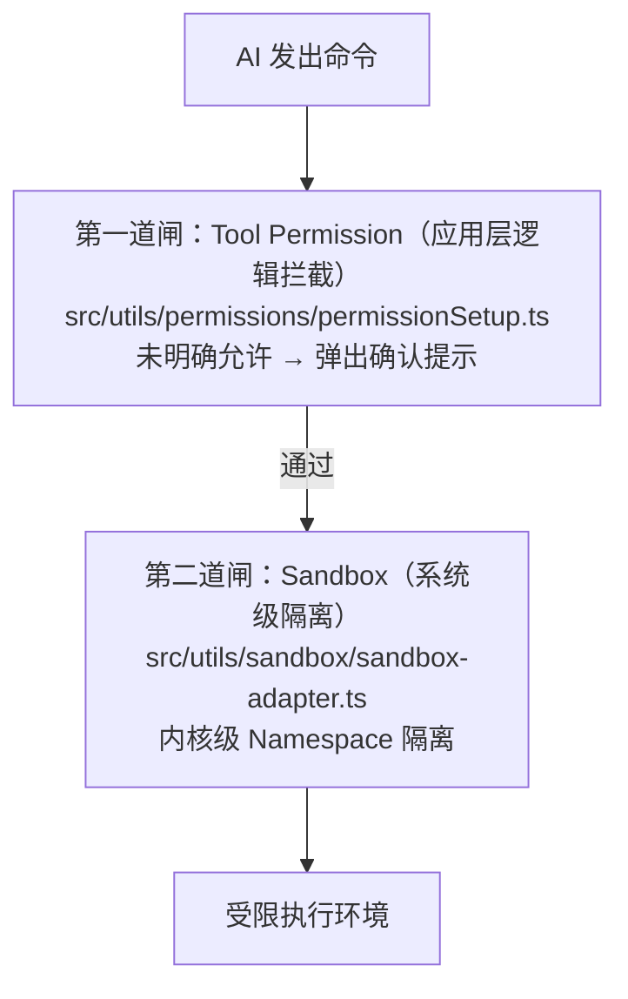

# 第 2 章：信息收集与安全机制

## 本章信息

| | |
|--|--|
| **本章目标** | 理解 Claude Code 的数据收集边界与安全防御体系 |
| **适合读者** | 关注隐私安全的用户、安全研究者 |
| **前置知识** | 无特殊要求 |
| **核心结论** | 最大风险来自"进入模型的工作上下文"，系统同时构建了双重权限闸、沙盒隔离等多层防线 |

---

## 核心结论

Claude Code 的安全态势呈现两面性：

- **风险面**：系统收集的上下文远超用户感知，模型上下文 + 本地 Memory + 外部同步叠加后形成强大的长期协作画像能力
- **防御面**：工程团队投入相当多精力，双重权限闸、沙盒隔离、密钥扫描、Unicode 清洗等机制均有扎实实现

---

## 第一节：信息收集的六层

### 1.1 第一层：进入模型的工作上下文（风险最高）

每次对话，以下内容都会打包发送到 Anthropic 模型 API：

| 内容类型 | 具体包含 | 敏感程度 |
|---------|---------|---------|
| 用户输入 | 所有对话内容 | 高 |
| 历史对话 | 当前 session 的完整来回 | 高 |
| 工具执行结果 | 命令输出、文件读取内容 | **极高** |
| 文件与代码片段 | 当前编辑文件内容 | 极高 |
| Git 状态快照 | diff、commit 信息 | 高 |
| CLAUDE.md / Memory 文件 | 自定义指令与长期记忆 | 高 |
| 图片、PDF 附件 | 截图等附件 | 中~高 |
| MCP 资源内容 | 第三方工具返回结果 | 不确定 |

> **关键点**：用户通常只关注"有没有数据上传"，而忽略了"什么在发送给模型"。Anthropic 接收的是包含源码、命令输出、文件内容的完整工作上下文。

### 1.2 第二层：本地持久化存储

以下数据在退出后依然保留：

- `transcript JSONL`：每次对话的完整逐条记录
- `session metadata`：会话标题、标签、时间
- `agent transcript`：子 agent 的独立记录
- `.claude/` 配置文件
- OAuth 账户缓存
- Memory 文件

**重要配置**：`cleanupPeriodDays` 控制 transcript 保留时长，默认非零值，历史对话持续积累。设为 `0` 或使用 `--no-session-persistence` 可关闭持久化。

### 1.3 第三层：Memory 长期积累

系统自动从过去对话提炼信息写入 Memory 文件，在每次对话开始时注入：

- 用户偏好与习惯
- 用户身份背景（职位、语言、技术栈）
- 项目关键事实
- 团队共享记忆（可跨用户同步）

### 1.4 第四层：Telemetry 遥测数据

上报到 Datadog 的使用统计：

| 字段 | 说明 |
|------|------|
| `deviceId` | 设备唯一标识 |
| `sessionId` | 会话标识 |
| app version / platform / arch | 版本与系统信息 |
| account UUID / org UUID | 账户与组织标识 |
| `subscriptionType` | 订阅类型 |
| `repo remote hash` | 远端仓库的哈希（非原文） |
| 工具使用事件 | 工具调用统计 |
| 文件路径/内容 hash | 哈希指纹（非原文） |

**工程亮点**：源码中的类型标记强制开发者在上报前手动签名确认数据不含代码原文：

```typescript
// src/services/analytics/index.ts
export type AnalyticsMetadata_I_VERIFIED_THIS_IS_NOT_CODE_OR_FILEPATHS = never
```

### 1.5 第五层：Team Memory 同步

启用后，系统会自动 push 本地 Memory 变更回 Anthropic 服务器。上传的是团队知识条目，可能含项目流程、内网知识、运维路径等。

### 1.6 第六层：用户主动上传

- **Transcript 分享**：提交反馈时上传会话记录（含 JSONL 原始数据）
- **Grove 功能**：若用户开启，编码会话可能被用于模型训练

---

## 第二节：攻击面与源码防御

### 2.1 Prompt Injection（提示词注入）

Claude Code 能读取文件、网页、MCP 返回内容并嵌入上下文，外部恶意内容可能诱导模型执行攻击指令。

**Unicode 隐写攻击**：用不可见 Unicode 字符隐藏指令（HackerOne #3086545 报告案例）。

**防御实现**：`src/utils/sanitization.ts` 的 `partiallySanitizeUnicode`：

```typescript
export function partiallySanitizeUnicode(prompt: string): string {
  let current = prompt
  let previous = ''
  let iterations = 0
  const MAX_ITERATIONS = 10

  while (current !== previous && iterations < MAX_ITERATIONS) {
    previous = current
    // Step 1: NFKC 规范化，统一合成字符
    current = current.normalize('NFKC')
    // Step 2: 删除危险 Unicode 类别（格式字符、私有字符等）
    current = current.replace(/[\p{Cf}\p{Co}\p{Cn}]/gu, '')
    // Step 3: 显式删除已知危险范围
    current = current
      .replace(/[​-‏]/g, '')   // 零宽字符
      .replace(/[‪-‮]/g, '')   // 方向性格式字符
      .replace(/[⁦-⁩]/g, '')   // 方向隔离字符
      .replace(/[]/g, '')          // BOM
      .replace(/[-]/g, '')   // 私有使用区
    iterations++
  }
  return current
}
```

循环执行直到文本稳定，防止嵌套混淆。`recursivelySanitizeUnicode` 处理 JSON 对象所有字符串字段。

### 2.2 Shell 命令注入防御

在 Auto Mode 下，以下危险模式的宽泛授权会被自动撤销：

```typescript
// src/utils/permissions/dangerousPatterns.ts
export const DANGEROUS_BASH_PATTERNS = [
  'python', 'python3', 'node', 'deno', 'ruby', 'perl', 'php',
  'npx', 'bunx', 'npm run', 'yarn run',
  'bash', 'sh', 'zsh', 'fish',
  'eval', 'exec', 'env', 'xargs', 'sudo',
  'ssh',
]
```

若用户配置 `Bash(python:*)` 宽泛授权，进入 Auto Mode 时会临时移除（`stripDangerousPermissionsForAutoMode`），退出后恢复（`restoreDangerousPermissions`）。

### 2.3 Git 逃逸攻击防御

攻击路径：在沙盒内创建假裸 Git 仓库 → 注入恶意 `core.fsmonitor` 配置 → 用户在宿主机执行 `git log` 触发恶意钩子。

防御：`scrubBareGitRepoFiles()` 在每次命令执行完毕后强制扫描并清空沙盒内的 Git 裸库文件（`HEAD`、`objects/`、`refs/`）。

### 2.4 MCP 不可信输入防御

- `recursivelySanitizeUnicode` 清洗所有 MCP 返回内容
- 独立权限认证系统（`src/services/mcp/auth.ts`）
- 沙盒将 MCP 触发的文件写入限制在白名单路径

---

## 第三节：多层防线体系

### 3.1 双重权限闸



### 3.2 Sandbox 沙盒详解

| 操作系统 | 技术 | 原理 |
|---------|------|------|
| Linux / WSL2 | `bubblewrap (bwrap)` + `socat` | 内核 Namespace 隔离 |
| macOS | 原生沙盒框架 | macOS 系统调用沙盒 |

沙盒采用**白名单驱动**的细粒度控制，精确控制哪些路径可读写、哪些域名可访问。

内置保护白名单（即使用户配置出错也会自动保护）：
- `~/.claude/settings.json`
- 当前工作目录的 `.claude/` 设置文件
- `.claude/skills/` 技能目录

**热更新同步**：`settingsChangeDetector` 监听配置变化，AI 无法利用"配置已改但沙盒还用旧规则"的时间窗口逃逸。

### 3.3 权限模式分级

| 模式 | 说明 | 适用场景 |
|------|------|---------|
| `default` | 每次操作前弹确认 | 日常使用，最安全 |
| `acceptEdits` | 自动批准文件编辑，命令仍需确认 | 轻度自动化 |
| `plan` | 只允许规划，不执行写操作 | 方案评审 |
| `auto` | 分类器自动判断，安全操作自动执行 | 高效开发 |
| `bypassPermissions` | 跳过所有权限检查 | CI/CD（危险！） |

`bypassPermissions` 有两层保护：Statsig 远程开关（组织级管控） + 本地配置禁用。

### 3.4 密钥扫描（Secret Scanner）

`src/services/teamMemorySync/secretScanner.ts` 内置 30+ 种密钥扫描规则：

```typescript
const SECRET_RULES = [
  { id: 'aws-access-token',   source: '\\b((?:A3T[A-Z0-9]|AKIA|ASIA|...)[A-Z2-7]{16})\\b' },
  { id: 'github-pat',         source: 'ghp_[0-9a-zA-Z]{36}' },
  { id: 'openai-api-key',     source: '\\b(sk-(?:proj|svcacct|admin)-...' },
  { id: 'anthropic-api-key',  source: `\\b(${ANT_KEY_PFX}03-...)` },
  // ... Stripe / Shopify / Slack / npm / PyPI 等 30+ 种
]
```

**工程细节**：
- 扫描结果不返回命中文本，只返回"哪条规则命中了"
- `redactSecrets` 把密钥替换为 `[REDACTED]` 而非直接报错
- Anthropic 自家密钥前缀通过字符串拼接构造，防止自动扫描工具误报

### 3.5 遥测隐私分级

```typescript
// src/utils/privacyLevel.ts
type PrivacyLevel = 'default' | 'no-telemetry' | 'essential-traffic'

export function getPrivacyLevel(): PrivacyLevel {
  if (process.env.CLAUDE_CODE_DISABLE_NONESSENTIAL_TRAFFIC)
    return 'essential-traffic'  // 关闭一切非必要网络
  if (process.env.DISABLE_TELEMETRY)
    return 'no-telemetry'       // 关闭遥测
  return 'default'
}
```

PII 字段通过 `_PROTO_*` 前缀标记，只路由到有访问控制的专属 BigQuery 列，不进入通用 Datadog 日志流。

---

## 本章小结

Claude Code 的安全架构同心圆模型：

```
数据出境防线：遥测隐私隔离 + 密钥扫描
    ↓
策略防线：权限模式分级管控
    ↓
应用防线：Tool Permission 应用层拦截
    ↓
底层防线：Sandbox 系统级隔离 + Unicode 清洗 + 路径校验
    ↓
宿主机（受保护）
```

**最重要的结论**：
- 真正的风险是"模型上下文 + 本地 Memory + 外部同步"三者叠加，而非单点遥测
- 关闭遥测无法解决进入模型的上下文问题
- 最有效的隐私保护：主动控制输入上下文边界

## 关键源码位置

| 文件 | 职责 |
|------|------|
| `src/utils/sanitization.ts` | Unicode 注入清洗 |
| `src/utils/permissions/dangerousPatterns.ts` | 危险命令黑名单 |
| `src/utils/sandbox/sandbox-adapter.ts` | 沙盒适配层 |
| `src/utils/permissions/PermissionMode.ts` | 权限模式定义 |
| `src/services/teamMemorySync/secretScanner.ts` | 密钥扫描 |
| `src/utils/privacyLevel.ts` | 隐私分级控制 |
| `src/services/analytics/index.ts` | 遥测数据管道 |

## 下一步阅读建议

- [第 7 章：Sandbox](/chapters/07-sandbox) — 沙盒的完整四层执行链路
- [第 13 章：深度发现](/chapters/13-extra-findings) — Trust 边界的程序化处理
- [Sandbox 权限控制流程图](/diagrams/sandbox-flow)
