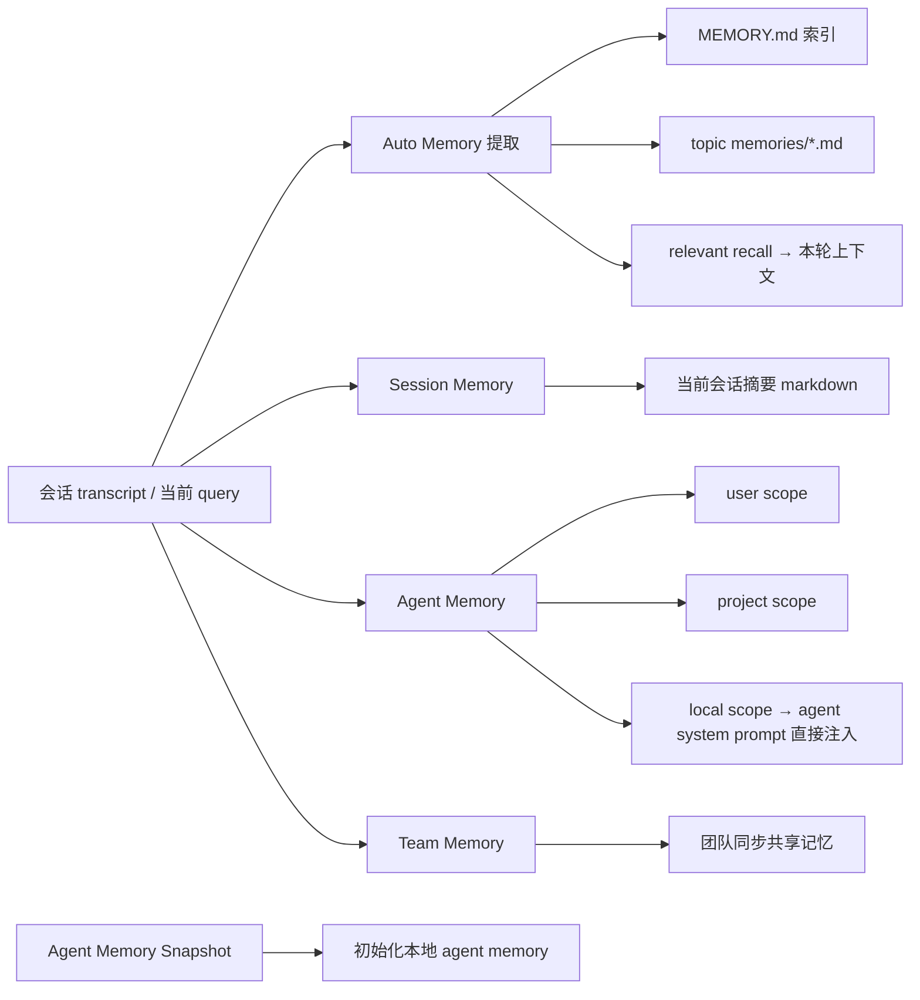
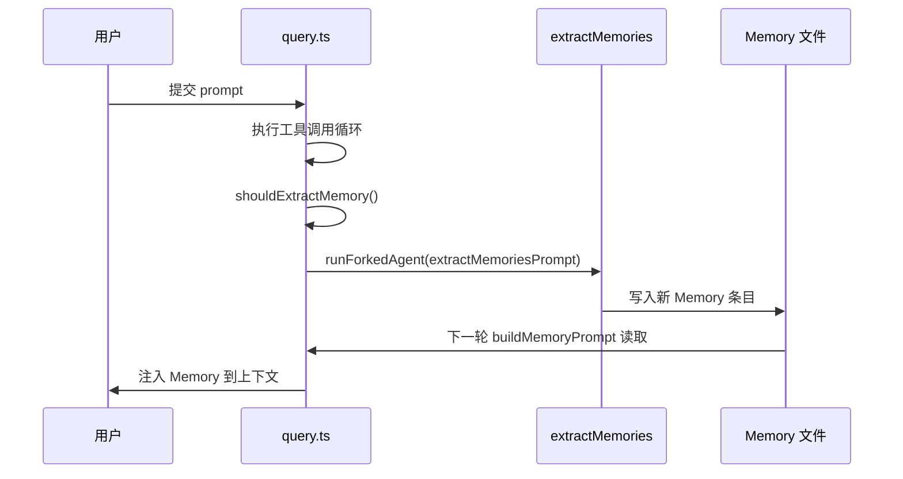

# 第 3 章：Agent Memory 机制

## 本章信息

| | |
|--|--|
| **本章目标** | 理解 Claude Code 四层 Memory 系统的存储结构、写入时机与召回机制 |
| **适合读者** | AI 工程师、关注 Agent 长期记忆设计的读者 |
| **前置知识** | 第 1 章 5.5 节（Persistence/Memory 层） |
| **核心结论** | Memory 是多层文件化系统，不是单一数据库；Agent Memory 与 agent 定义深度耦合，是 agent runtime 的组成部分 |

---

## 核心结论

这个项目没有把 Memory 做成单一数据库，而是做成了"**多层文件化记忆系统**"。其中 Agent Memory 只是一层，但它和 agent 定义、agent prompt、工具权限、snapshot 初始化、UI 文件选择器都耦合在一起，是 agent runtime 的组成部分。

---

## Memory 系统总图



---

## 四层 Memory 设计

### 为什么不用单一数据库

核心设计原则："把不同生命周期、不同作用域、不同可见性的内容分开保存"。

| 层次 | 作用域 | 生命周期 | 可见性 |
|------|------|---------|------|
| **Auto Memory** | 用户 + 项目 | 跨会话长期 | 用户本地 |
| **Session Memory** | 当前会话 | 单会话 | 用户本地 |
| **Agent Memory** | 特定 agent 类型 | 跨会话持久 | agent 定义绑定 |
| **Team Memory** | 团队 / repo | 跨用户同步 | 团队共享 |

### Auto Memory：最核心的长期记忆

**关键文件**：`src/memdir/memdir.ts`、`src/memdir/findRelevantMemories.ts`

```typescript
// src/memdir/memdir.ts 常量
export const ENTRYPOINT_NAME      = 'MEMORY.md'
export const MAX_ENTRYPOINT_LINES = 200
export const MAX_ENTRYPOINT_BYTES = 25_000

// 核心构建函数
export function buildMemoryPrompt(params: {
  displayName: string
  memoryDir:   string
  extraGuidelines?: string[]
}): string {
  const entrypoint = params.memoryDir + ENTRYPOINT_NAME
  const raw = fs.readFileSync(entrypoint, { encoding: 'utf-8' })  // 同步读取
  const t   = truncateEntrypointContent(raw)   // 硬截断保护（200 行 / 25KB）
  // ...
}
```

`MEMORY.md` 的截断保护确保 Memory 索引文件不会无限膨胀并耗尽 Context。

**相关性召回**：`findRelevantMemories()` 在每轮对话前选出少量与当前任务最相关的 Memory 文件，而非全量注入。

### Session Memory：辅助长会话

**目的**：在长会话中辅助 compact（上下文压缩），让模型在压缩后仍能"记住这轮会话在做什么"。

```
当前会话进行中
  → shouldCompact() 触发
  → Session Memory 记录当前摘要
  → compact() 压缩历史消息
  → 摘要在新轮次中注入，continuity 不中断
```

### Agent Memory：与 agent 定义深度绑定

**关键文件**：`src/tools/AgentTool/agentMemory.ts`、`src/tools/AgentTool/loadAgentsDir.ts`

Agent Memory 有三个 scope，与 agent 类型直接绑定：

```typescript
// src/tools/AgentTool/agentMemory.ts
type AgentMemoryScope = 'user' | 'project' | 'local'

// 加载时直接注入到 agent system prompt
function buildAgentSystemPromptWithMemory(
  agentDef: AgentDefinition,
  memoryPath: string
): string {
  const memory = loadAgentMemory(agentDef.name, scope)
  return `${agentDef.systemPrompt}\n\n${memory}`
}
```

**Agent Memory Snapshot**：新 agent 实例化时用 snapshot 初始化本地记忆；snapshot 有新版本时会提示本地用户同步。

### Team Memory：组织级知识同步

**流程**：
1. 按 repo 识别团队 Memory 命名空间
2. 从服务器 pull 团队 Memory 到本地
3. 监听本地 Memory 目录文件变更（`src/services/teamMemorySync/watcher.ts`）
4. 自动 push 变更回 Anthropic 服务器

启用时注意：上传内容可能含项目流程、内网知识、运维路径等敏感信息。系统在上传前会做密钥扫描，但不能完全替代信息边界管理。

---

## Memory 写入时机



**写入触发条件**：`shouldExtractMemory()` 基于对话长度、内容类型等启发式判断，不是每轮都触发。

---

## Memory 召回机制

**相关文件**：`src/memdir/findRelevantMemories.ts`

召回过程：

1. 读取 `MEMORY.md` 索引（硬截断至 200 行）
2. 根据当前 query 内容做相关性匹配
3. 选出少量（而非全量）最相关的 topic Memory 文件
4. 通过 `buildMemoryPrompt()` 拼入当前 system prompt

```
注入位置：system prompt（每轮对话开始前注入）
注入格式：## MEMORY.md\n{内容}\n## topic-file.md\n{内容}
```

---

## UI 集成：文件选择器

**文件**：`src/components/memory/MemoryFileSelector.tsx`

用户可以在 TUI 界面中直接选择、查看、编辑哪些 Memory 文件是活跃的。这说明 Memory 系统不是对用户完全透明的黑盒，而是设计了可见性和可操作性。

---

## 本章小结

Claude Code 的 Memory 系统：

1. **文件化**：Memory 存为 Markdown 文件，可审计、可 diff、可手动编辑
2. **分层**：四层独立 scope，不同生命周期、不同可见性分开管理
3. **相关性召回**：不是全量注入，而是按需选取
4. **深耦合**：Agent Memory 与 agent 定义直接绑定，是 agent 的一部分，不是附属品
5. **保护机制**：`MEMORY.md` 硬截断（200 行 / 25KB），防止 Memory 侵占 Context

## 关键源码位置

| 文件 | 职责 |
|------|------|
| `src/memdir/memdir.ts` | Auto Memory 核心构建，MEMORY.md 读取与截断 |
| `src/memdir/paths.ts` | Memory 目录路径管理 |
| `src/memdir/findRelevantMemories.ts` | 相关性召回 |
| `src/services/SessionMemory/sessionMemory.ts` | Session Memory |
| `src/tools/AgentTool/agentMemory.ts` | Agent Memory，scope 管理 |
| `src/tools/AgentTool/agentMemorySnapshot.ts` | Agent Memory 快照 |
| `src/services/teamMemorySync/index.ts` | Team Memory 同步 |
| `src/components/memory/MemoryFileSelector.tsx` | TUI 文件选择器 |

## 下一步阅读建议

- [第 9 章：Prompt 管理](/chapters/09-prompt) — Memory 如何注入到 system prompt
- [第 11 章：Session 持久化](/chapters/11-session-storage) — transcript 与 Memory 的关系
- [第 10 章：Multi-Agent](/chapters/10-multi-agent) — Agent Memory 在多 Agent 中的角色
- [Memory 管理流程图](/diagrams/memory-flow)
