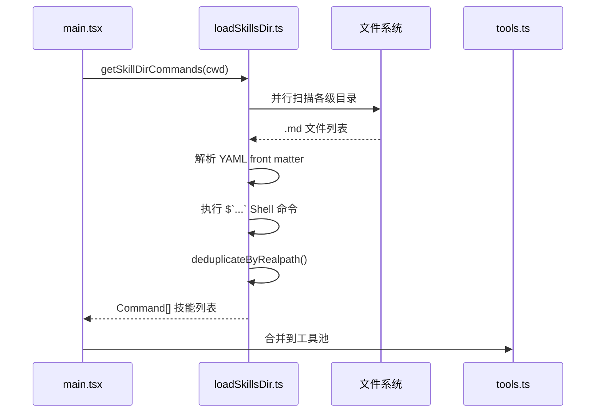

# 第 4 章：Skills 技能机制

## 本章信息

| | |
|--|--|
| **本章目标** | 理解 Claude Code 技能扩展系统的结构与运行机制 |
| **适合读者** | 想为 Claude Code 开发自定义技能的开发者 |
| **前置知识** | 第 1 章（命令与模式分发层） |
| **核心结论** | Skills 通过 Markdown + YAML + 可选 Bash 三者结合，低门槛地为 AI 注入领域能力 |

---

## 核心结论

Claude Code 通过 **Skills（技能）机制** 实现平台化扩展：把 Markdown 文件 + YAML 元数据 + 可选 Bash 脚本三者结合，以低门槛方式为 AI 注入领域知识和执行能力。

Skills 不是"命令宏"，而是带有完整元数据的能力单元，系统会在合适的时机自动发现、加载和注入。

---

## Skills 的三种来源

| 类型 | 来源路径 | `loadedFrom` 值 |
|------|---------|----------------|
| **文件系统技能** | `.claude/skills/` 目录 | `'skills'` |
| **内建打包技能** | 源码内硬编码 | `'bundled'` |
| **MCP Skills** | MCP Server 工具能力映射 | `'mcp'` |

---

## 技能发现：`getSkillDirCommands()`

技能发现从多个目录并行加载：

```typescript
// src/skills/loadSkillsDir.ts:638
export const getSkillDirCommands = memoize(
  async (cwd: string): Promise<Command[]> => {
    const userSkillsDir     = join(getClaudeConfigHomeDir(), 'skills')  // ~/.claude/skills
    const managedSkillsDir  = join(getManagedFilePath(), '.claude', 'skills')  // 策略管理目录
    const projectSkillsDirs = getProjectDirsUpToHome('skills', cwd)    // 向上爬取项目目录

    // 并行加载所有来源
    const [managedSkills, userSkills, projectSkills, ...] =
      await Promise.all([
        loadSkillsFromSkillsDir(managedSkillsDir, 'policySettings'),  // 策略级技能（最高优先级）
        loadSkillsFromSkillsDir(userSkillsDir,    'userSettings'),    // 用户级技能
        Promise.all(projectSkillsDirs.map(dir =>
          loadSkillsFromSkillsDir(dir, 'projectSettings'))),          // 项目级技能（多目录）
        loadSkillsFromCommandsDir(cwd),                               // 旧版 /commands/ 目录
      ])

    // 合并 + 去重（inode 级别，防止软链重复）
    return deduplicateByRealpath([...managedSkills, ...userSkills, ...])
  }
)
```

发现顺序体现了优先级：策略级 > 用户级 > 项目级。

---

## 技能文件格式

一个完整的 Skill 文件（`.md`）包含：

```markdown
---
name: my-skill
description: 这是技能的简短说明，会显示在 / 命令列表
author: 作者名
version: 1.0.0
tags: [git, workflow]
# 可选：指定此技能在哪些工具调用环境下执行
allowedTools: [BashTool, FileReadTool]
---

# My Skill

这里是注入给 AI 的 Markdown 内容，描述如何完成特定任务。

## 使用方法

1. 步骤一
2. 步骤二

## 注意事项

- 注意事项一
```

YAML front matter 提供元数据，Markdown 正文作为注入给模型的能力描述。

---

## Prompt 内嵌 Shell 执行

**文件**：`src/utils/promptShellExecution.ts`

Skills 支持在 Markdown 正文中内嵌 Shell 命令，语法为：

```markdown
执行前先获取当前 git 状态：
$`git status --short`

当前分支：
$`git branch --show-current`
```

这些 `$\`...\`` 表达式在技能加载时被执行，结果内联到 Skill 内容中再注入模型上下文。这使技能能包含动态的运行时信息（如当前环境状态）。

---

## 内建打包技能

**文件**：`src/skills/bundledSkills.ts`

内建技能在源码中硬编码，随安装包分发，用户无需手动安装。包含：

- 代码审查技能
- Git 工作流技能
- 文档生成技能
- 调试辅助技能

`initBundledSkills()` 在 `main.tsx` 初始化阶段调用，确保内建技能始终可用。

---

## Skills 加载流程



---

## 与命令系统的关系

Skills 在系统中以 `/skill-name` 的形式被用户调用，与内建斜杠命令共享同一命令注册表。区别是：

- **内建命令**：源码中硬编码，功能固定
- **Skills**：文件系统驱动，用户可自定义

用户在 REPL 中输入 `/` 后，会看到内建命令和所有已发现的 Skills 合并展示。

---

## 本章小结

Skills 机制的核心设计理念：**低门槛 + 高可定制**。

- 任何 Markdown + YAML 文件都可以成为技能
- 技能可以包含动态 Shell 命令（`$\`...\`` 语法）
- 多级目录发现，支持用户级、项目级、策略级三层管理
- 与 MCP 无缝集成：MCP Server 工具可以直接映射为 Skill

## 关键源码位置

| 文件 | 职责 |
|------|------|
| `src/skills/loadSkillsDir.ts` | 技能发现、解析、实例化 |
| `src/skills/bundledSkills.ts` | 内建打包技能 |
| `src/utils/promptShellExecution.ts` | prompt 内嵌 Shell 执行 |

## 下一步阅读建议

- [第 5 章：Tool Call 实现](/chapters/05-tool-call) — Skills 执行时底层的工具调用机制
- [第 6 章：MCP 集成](/chapters/06-mcp) — MCP Skills 的技术实现
