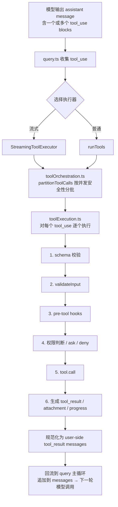

# 第 5 章：Tool Call 实现

## 本章信息

| | |
|--|--|
| **本章目标** | 理解从 `tool_use` 到 `tool_result` 的完整工具调用执行链路 |
| **适合读者** | AI 工程师、理解 Agent 工具调用机制的读者 |
| **前置知识** | 第 1 章（执行内核、Tool/Permission 层） |
| **核心结论** | Tool Call 是一条工程上可控、可并发、可审计、可回流的执行链，不是简单的函数调用 |

---

## 核心结论

Claude Code 把"模型发起 tool_use"变成了一条工程上可控的执行链：

```
tool_use → schema 校验 → 权限判断 → Hook 执行 → tool.call() → tool_result → 回流到下一轮
```

关键特性：**并发安全分批**、**完整的 Hook 体系**、**流式结果 yield**、**类型安全的 schema 校验**。

---

## 完整执行链路



---

## Tool 定义结构

**文件**：`src/Tool.ts`

```typescript
// Tool 基础接口（简化）
interface Tool<TInput, TOutput> {
  name:               string
  description:        string
  inputSchema:        ZodSchema<TInput>      // 输入 schema，用于自动校验
  isConcurrencySafe:  (input: TInput) => boolean  // 是否可并发执行

  // 权限检查：返回 'allow' | 'ask' | 'deny'
  checkPermission:    (input: TInput, ctx: ToolUseContext) => PermissionResult

  // 核心执行函数
  call:               (input: TInput, ctx: ToolUseContext) => AsyncGenerator<ToolOutput>
}
```

每个 Tool 必须声明 `isConcurrencySafe`，这个属性驱动了整个并发调度体系。

---

## 工具池组装

**文件**：`src/tools.ts`

```typescript
export function getTools(permissionContext: PermissionContext): Tool[] {
  return [
    BashTool,
    FileReadTool,
    FileEditTool,
    FileWriteTool,
    GlobTool,
    GrepTool,
    WebFetchTool,
    AgentTool,
    // MCP 工具在此合并
    ...mcpTools.map(convertMcpToolToInternalTool),
    // Skills 工具在此合并
    ...skillTools,
  ].filter(tool => tool.isEnabled(permissionContext))
}
```

工具池在 `main.tsx` 初始化时组装一次，随后以引用传递给 `query.ts`。

---

## 并发调度：`partitionToolCalls()`

这是工具调度的核心算法：

```typescript
// src/services/tools/toolOrchestration.ts
function partitionToolCalls(
  toolUseMessages: ToolUseBlock[],
  ctx: ToolUseContext
): Batch[] {
  return toolUseMessages.reduce((acc: Batch[], toolUse) => {
    const tool = findToolByName(ctx.options.tools, toolUse.name)
    const isConcurrencySafe = Boolean(tool?.isConcurrencySafe(parsedInput.data))

    // 若上一批次也是并发安全的，就合入同一批次
    if (isConcurrencySafe && acc[acc.length - 1]?.isConcurrencySafe) {
      acc[acc.length - 1]!.blocks.push(toolUse)
    } else {
      acc.push({ isConcurrencySafe, blocks: [toolUse] })
    }
    return acc
  }, [])
}
```

**分批规则**：

```
[FileRead, FileRead, FileRead, Bash, FileWrite, FileRead]
→ 分批结果：
  批次 1: [FileRead, FileRead, FileRead]  → 并发执行（isConcurrencySafe = true）
  批次 2: [Bash]                          → 串行执行（isConcurrencySafe = false）
  批次 3: [FileWrite]                     → 串行执行
  批次 4: [FileRead]                      → 并发执行（只有一个，相当于串行）
```

并发执行：`runToolsConcurrently()`  
串行执行：`runToolsSerially()`

---

## 单工具执行流程（`toolExecution.ts`）

```typescript
// src/services/tools/toolExecution.ts（精简伪代码）
async function* executeSingleTool(
  toolUse: ToolUseBlock,
  tool: Tool,
  ctx: ToolUseContext
): AsyncGenerator<ToolOutput> {

  // Step 1: Zod schema 校验
  const parsed = tool.inputSchema.safeParse(toolUse.input)
  if (!parsed.success) {
    yield { type: 'error', message: formatZodError(parsed.error) }
    return
  }

  // Step 2: 自定义 validateInput（额外业务逻辑校验）
  const validationError = await tool.validateInput?.(parsed.data, ctx)
  if (validationError) {
    yield { type: 'error', message: validationError }
    return
  }

  // Step 3: pre-tool hooks
  await runPreToolHooks(tool.name, parsed.data, ctx)

  // Step 4: 权限检查
  const permission = tool.checkPermission(parsed.data, ctx)
  if (permission === 'ask') {
    const userDecision = await askUserForPermission(tool, parsed.data)
    if (userDecision === 'deny') {
      yield { type: 'denied' }
      return
    }
  }

  // Step 5: 执行工具
  for await (const output of tool.call(parsed.data, ctx)) {
    yield output   // 流式 yield，实时更新 UI
  }

  // Step 6: post-tool hooks
  await runPostToolHooks(tool.name, parsed.data, ctx)
}
```

---

## Hook 体系

Hook 在工具调用的前后触发，用于：

- 日志记录
- 权限检查扩展
- 结果转换
- 自定义副作用

Hook 配置存在 `.claude/settings.json` 中，系统通过 `settingsChangeDetector` 监听变化实时生效。

---

## tool_result 规范化

工具执行完成后，结果被规范化为 Claude API 期望的格式：

```typescript
// 规范化后的 tool_result message
{
  role: 'user',
  content: [{
    type: 'tool_result',
    tool_use_id: toolUse.id,
    content: [{ type: 'text', text: outputText }],  // 或 image block
    is_error: false,
  }]
}
```

这个 message 随后追加到 `messages` 数组，触发下一轮模型调用。

---

## 内建工具列表

| 工具名 | 功能 | 并发安全 |
|-------|------|---------|
| `BashTool` | 执行 Shell 命令 | ❌ |
| `FileReadTool` | 读取文件内容 | ✅ |
| `FileEditTool` | 编辑文件（精确字符串替换） | ❌ |
| `FileWriteTool` | 写入整个文件 | ❌ |
| `GlobTool` | 文件路径模式匹配 | ✅ |
| `GrepTool` | 文件内容搜索 | ✅ |
| `WebFetchTool` | 获取网页内容 | ✅ |
| `AgentTool` | 派生子 Agent | ❌ |

---

## 本章小结

Tool Call 机制的关键工程价值：

1. **Schema 驱动**：Zod schema 自动校验，错误反馈直接给模型而非崩溃
2. **并发安全分批**：`isConcurrencySafe` 驱动批次划分，在安全前提下最大化并发
3. **Hook 体系**：pre/post-tool 钩子提供可扩展的副作用管理
4. **流式输出**：`AsyncGenerator` 输出让 UI 实时更新，不等到工具完成才响应
5. **闭环回流**：`tool_result` 规范化后自动追加到 `messages`，驱动下一轮模型调用

## 关键源码位置

| 文件 | 职责 |
|------|------|
| `src/Tool.ts` | Tool 接口定义 |
| `src/tools.ts` | 工具池组装 |
| `src/services/tools/toolOrchestration.ts` | 并发调度与分批 |
| `src/services/tools/toolExecution.ts` | 单工具执行流程 |
| `src/services/tools/StreamingToolExecutor.ts` | 流式执行器 |
| `src/query.ts` | 工具结果回流到主循环 |

## 下一步阅读建议

- [第 6 章：MCP 集成](/chapters/06-mcp) — MCP 工具如何统一进工具池
- [第 7 章：Sandbox](/chapters/07-sandbox) — BashTool 执行时的沙盒隔离
- [Tool Call 调用流程图](/diagrams/tool-call-flow)
