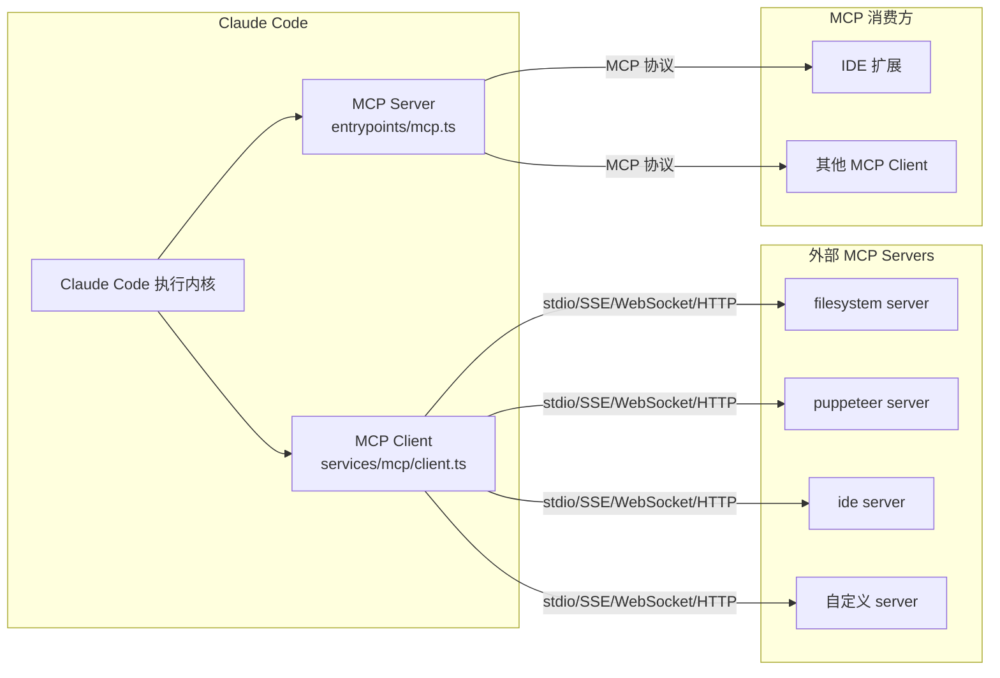
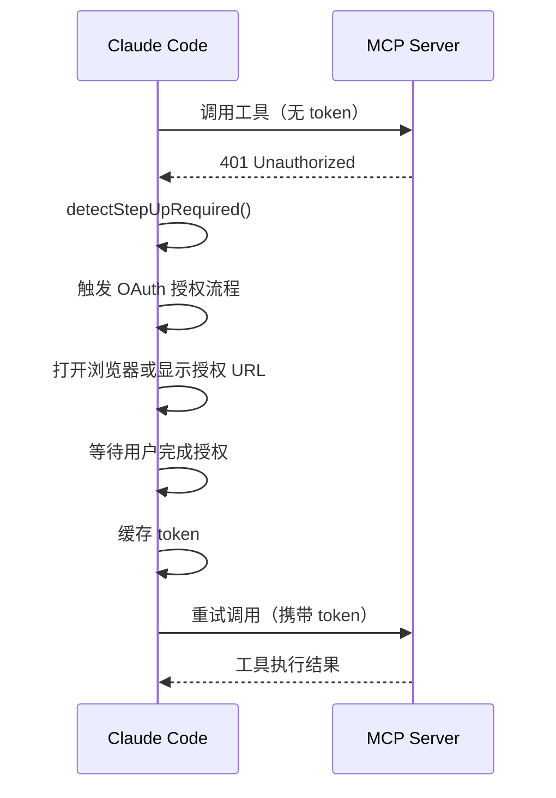

# 第 6 章：MCP 集成机制

## 本章信息

| | |
|--|--|
| **本章目标** | 理解 Claude Code 对 MCP 协议的完整集成方案 |
| **适合读者** | 希望集成或开发 MCP Server 的开发者 |
| **前置知识** | 第 5 章（Tool Call 机制） |
| **核心结论** | Claude Code 是双向 MCP 节点：既作为 Client 消费外部能力，也作为 Server 对外暴露自身工具 |

---

## 核心结论

Claude Code 对 MCP 做了**深度双向集成**：

- 作为 **MCP Client**：通过 4 种传输协议连接外部 MCP Server，统一加入工具池
- 作为 **MCP Server**：把内部 Tool 包装成 MCP schema 对外暴露

支持完整的 OAuth 认证体系和并发安全管理。

---

## MCP 架构总览



---

## 工具命名规则

所有 MCP 工具进入工具池时，名称通过 `buildMcpToolName()` 统一规范：

```typescript
// src/services/mcp/mcpStringUtils.ts
export function buildMcpToolName(serverName: string, toolName: string): string {
  return `mcp__${serverName}__${toolName}`
  // 示例：
  //   mcp__filesystem__read_file
  //   mcp__puppeteer__screenshot
  //   mcp__ide__getDiagnostics
}
```

这个统一命名让工具池中的 MCP 工具和内建工具保持一致 schema，模型无需区分来源。

---

## 四种传输协议

**文件**：`src/services/mcp/client.ts`

```typescript
export const connectToServer = memoize(
  async (name: string, serverRef: ScopedMcpServerConfig): Promise<MCPServerConnection> => {
    let transport

    if (serverRef.transport === 'stdio') {
      // 标准输入输出（最常用，本地进程通信）
      const { command, args, env } = serverRef
      transport = new StdioClientTransport({ command, args, env })
    }
    else if (serverRef.transport === 'sse') {
      // Server-Sent Events（单向推送，适合云服务）
      transport = new SSEClientTransport(new URL(serverRef.url))
    }
    else if (serverRef.transport === 'websocket') {
      // WebSocket（双向，适合需要实时交互的场景）
      transport = new WebSocketClientTransport(new URL(serverRef.url))
    }
    else if (serverRef.transport === 'http') {
      // HTTP 轮询（最简单，无需持久连接）
      transport = new HttpClientTransport(new URL(serverRef.url))
    }

    const client = new Client({ name: 'claude-code', version })
    await client.connect(transport)
    return { client, transport }
  }
)
```

`memoize` 包装确保同一 server 配置只建立一次连接，避免重复握手。

---

## OAuth 认证与 Step-up 检测

**文件**：`src/services/mcp/auth.ts`

MCP 支持 OAuth 2.0 认证流程：



**Step-up 检测**：部分工具调用可能触发更高权限要求（step-up auth），系统能自动识别并引导用户完成额外授权步骤。

---

## MCP Server 形态

**文件**：`src/entrypoints/mcp.ts`

Claude Code 也可以作为 MCP Server 运行：

```typescript
async function startMcpServer() {
  const server = new McpServer({ name: 'claude-code', version })

  // 把内部 Tool 重新包装为 MCP tool schema
  for (const tool of getInternalTools()) {
    server.registerTool(
      tool.name,
      tool.inputSchema,
      wrapToolAsMcpHandler(tool)
    )
  }

  // 通过 stdio 暴露（IDE 通常用 stdio 连接）
  await server.connect(new StdioServerTransport())
}
```

这使得 IDE 插件（VS Code、JetBrains 等）可以通过 MCP 协议调用 Claude Code 的内部工具能力。

---

## MCP 工具加载流程

```typescript
// src/main.tsx 初始化阶段
const { mcpTools, mcpCommands, mcpResources } =
  await getMcpToolsCommandsAndResources()

// MCP 工具合并进内建工具池
const tools = [
  ...getInternalTools(permissionContext),
  ...mcpTools,    // MCP 工具名为 mcp__server__tool 格式
]
```

MCP 工具和内建工具共享同一套 schema 校验、权限检查、Hook 体系，区别只是执行时通过 MCP 协议代理到外部 server。

---

## 遥测中的 MCP 脱敏

上报时，MCP 工具名中的 server 名称被替换为通用标签，避免暴露用户的私有 MCP 配置：

```typescript
// src/services/analytics/metadata.ts
export function sanitizeToolNameForAnalytics(toolName: string) {
  if (toolName.startsWith('mcp__')) {
    return 'mcp_tool'  // 不暴露 server 名称
  }
  return toolName
}
```

---

## MCP 安全考虑

| 风险 | 防御措施 |
|------|---------|
| 不可信 MCP Server 返回恶意内容 | `recursivelySanitizeUnicode` 清洗所有返回内容 |
| MCP 触发文件写入超出范围 | 沙盒白名单路径限制 |
| MCP Server 伪造工具结果 | 独立权限认证系统（`auth.ts`） |

---

## 本章小结

Claude Code 的 MCP 集成有三个关键设计：

1. **双向节点**：既是 Client（消费外部工具），也是 Server（暴露内部工具），一套代码两种用途
2. **四协议支持**：stdio / SSE / WebSocket / HTTP，覆盖本地到云端的各种部署场景
3. **统一工具池**：MCP 工具与内建工具共享同一套执行体系，模型视角完全透明

## 关键源码位置

| 文件 | 职责 |
|------|------|
| `src/services/mcp/client.ts` | MCP Client 核心，连接管理 |
| `src/services/mcp/auth.ts` | OAuth 认证与 Step-up 检测 |
| `src/services/mcp/mcpStringUtils.ts` | 工具命名规则 |
| `src/utils/mcpWebSocketTransport.ts` | WebSocket 传输层实现 |
| `src/entrypoints/mcp.ts` | MCP Server 入口 |

## 下一步阅读建议

- [第 7 章：Sandbox](/chapters/07-sandbox) — MCP 触发操作的安全隔离
- [第 10 章：Multi-Agent](/chapters/10-multi-agent) — MCP 在多 Agent 中的角色
- [MCP 集成流程图](/diagrams/mcp-flow)
