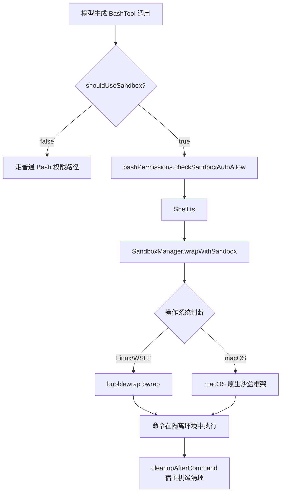

# 第 7 章：Sandbox 沙盒机制

## 本章信息

| | |
|--|--|
| **本章目标** | 理解 Sandbox 四层执行链路，从判断入沙箱到命令后清理的完整机制 |
| **适合读者** | 安全研究者、希望理解 Claude Code 底层隔离能力的读者 |
| **前置知识** | 第 2 章第三节（防范性安全措施） |
| **核心结论** | Sandbox 不是简单的"包一层 bwrap"，而是与权限系统深度集成的四层执行链 |

---

## 核心结论

Claude Code 里的 Sandbox **不是"调用前包一层 bwrap"**那么简单，而是四层结构：

1. `shouldUseSandbox()` — 决定某条命令是否进沙箱
2. `convertToSandboxRuntimeConfig()` — 把 Claude Code settings 语义翻译成 sandbox runtime 理解的文件系统/网络限制
3. `bashPermissions.ts` — 把"沙箱自动放行"和"显式 deny/ask 规则"揉在一起，避免沙箱把权限系统绕过去
4. `Shell.ts` + `cleanupAfterCommand()` — 真正执行并在命令后做宿主机级清理

---

## 整体执行链路



---

## 第一层：`shouldUseSandbox()` — 入沙箱判断

**文件**：`src/tools/BashTool/shouldUseSandbox.ts`

不是所有命令都进沙箱，判断逻辑基于以下因素：

```typescript
export function shouldUseSandbox(
  input: BashInput,
  permissionMode: PermissionMode,
  sandboxConfig: SandboxConfig,
): boolean {
  // 用户配置明确关闭沙箱
  if (sandboxConfig.enabled === false) return false

  // bypassPermissions 模式下沙箱依然生效（沙箱是独立防线）
  if (permissionMode === 'bypassPermissions') return sandboxConfig.enabled

  // 命令是否在沙箱白名单中
  if (isCommandExemptFromSandbox(input.command)) return false

  // 默认在沙箱中执行
  return true
}
```

---

## 第二层：配置翻译 `convertToSandboxRuntimeConfig()`

**文件**：`src/utils/sandbox/sandbox-adapter.ts`

把 Claude Code 的 settings 语义（用户能理解的权限规则）翻译成 sandbox runtime 能理解的底层配置：

```typescript
function convertToSandboxRuntimeConfig(
  permissions: PermissionSettings,
  cwd: string,
): SandboxRuntimeConfig {
  return {
    filesystem: {
      allowWrite: [
        cwd,
        ...permissions.allowedPaths.filter(isWriteAllowed),
      ],
      denyWrite: [
        '~/.claude/settings.json',   // 主配置不被篡改
        `${cwd}/.claude/`,           // 项目设置不被篡改
      ],
      allowRead: [...用户允许读取的路径],
      denyRead:  [...敏感配置路径],
    },
    network: {
      allowedDomains:   [...从 WebFetchTool 规则提取的域名],
      deniedDomains:    [...被拒绝的域名],
      allowManagedOnly: isEnterpriseMode(permissions),
    }
  }
}
```

**内置保护**：无论用户配置如何，以下路径始终受保护：
- `~/.claude/settings.json`（全局配置）
- `{cwd}/.claude/`（项目设置）
- `.claude/skills/`（技能目录）

---

## 第三层：权限与沙箱协同（`bashPermissions.ts`）

**文件**：`src/tools/BashTool/bashPermissions.ts`

沙箱启用不等于绕过权限系统。沙箱有自动放行机制（对沙箱内无害的操作自动批准），但显式 deny/ask 规则仍然生效：

```
命令到达 BashTool
  │
  ├─ shouldUseSandbox() = true
  │     │
  │     ├─ checkSandboxAutoAllow()
  │     │     ├─ 操作在沙箱内无害且无显式 deny → 自动放行
  │     │     └─ 有显式 deny 规则 → 拒绝
  │     │
  │     └─ 没有自动放行 → 走正常 ask/deny 权限流程
  │
  └─ shouldUseSandbox() = false → 走普通 BashTool 权限路径
```

这个设计防止了"命令进了沙箱，用户以为沙箱会自动阻止所有危险，所以取消了显式权限审查"的安全假设错误。

---

## 第四层：执行与清理（`Shell.ts` + `cleanupAfterCommand()`）

**文件**：`src/utils/Shell.ts`、`src/utils/sandbox/sandbox-adapter.ts`

```typescript
// Shell.ts 核心执行逻辑（伪代码）
async function executeInSandbox(command: string, config: SandboxRuntimeConfig) {
  const sandboxedCommand = SandboxManager.wrapWithSandbox(command, config)
  const result = await exec(sandboxedCommand)
  await cleanupAfterCommand(config.workdir)
  return result
}

// cleanupAfterCommand：宿主机级清理
async function cleanupAfterCommand(dir: string) {
  // 关键防护：扫描并清空沙盒内植入的 Git 裸库文件
  // 防止 Git 逃逸攻击（详见第 2 章 2.3 节）
  await scrubBareGitRepoFiles(dir)
}
```

`scrubBareGitRepoFiles()` 在每次命令后运行，防止多阶段 Git 逃逸攻击。

---

## 底层技术

### Linux / WSL2：`bubblewrap (bwrap)`

`bwrap` 是 Flatpak 使用的用户空间沙箱工具，基于 Linux Namespace：

```bash
# bwrap 调用示例（简化）
bwrap \
  --ro-bind /usr /usr \
  --bind /tmp/workspace /workspace \
  --unshare-net \           # 网络隔离
  --unshare-pid \           # PID 隔离
  --new-session \
  -- /bin/bash -c "命令"
```

Namespace 隔离意味着沙箱内进程看到的文件系统、网络、PID 完全是独立视图，即使写入 `/etc/passwd` 也不影响宿主机。

### macOS：原生沙盒框架

使用 macOS 系统调用级沙盒，通过 `sandbox-exec` 和 profile 文件定义允许的系统调用范围。

---

## 热更新同步

`settingsChangeDetector` 监听配置文件变化，一旦用户在运行过程中修改权限配置，沙盒内存中的配置通过 `refreshConfig()` 实时同步。

**意义**：AI 无法利用"配置已改但沙盒还用旧规则"的时间窗口逃逸。

---

## Doctor 诊断

**文件**：`src/components/sandbox/SandboxDoctorSection.tsx`

`/doctor` 命令中包含 Sandbox 诊断节，能检测：
- 当前系统是否支持沙箱
- `bwrap` 是否可用
- 沙箱配置是否有效

---

## 本章小结

Sandbox 在 Claude Code 中不是外围安全功能，而是 Bash 执行链路的核心组件：

1. **四层分工**：判断 → 配置翻译 → 权限协同 → 执行与清理，各层职责清晰
2. **双重防线**：沙盒是第二道闸，不替代 Tool Permission 权限系统
3. **主动清理**：命令完成后自动执行 Git 裸库扫描，防止多阶段逃逸
4. **实时同步**：配置热更新，消除时间窗口逃逸漏洞

## 关键源码位置

| 文件 | 职责 |
|------|------|
| `src/tools/BashTool/shouldUseSandbox.ts` | 沙箱启用判断 |
| `src/utils/sandbox/sandbox-adapter.ts` | 配置翻译、Git 裸库清理 |
| `src/tools/BashTool/bashPermissions.ts` | 权限与沙箱协同 |
| `src/utils/Shell.ts` | 命令执行包装 |
| `src/components/sandbox/SandboxDoctorSection.tsx` | Sandbox 诊断 UI |

## 下一步阅读建议

- [第 2 章：安全分析](/chapters/02-security-info-collection) — 安全整体架构
- [第 13 章：深度发现](/chapters/13-extra-findings) — Trust 边界处理
- [Sandbox 权限控制流程图](/diagrams/sandbox-flow)
