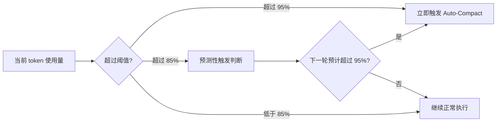

# 第 8 章：Context 上下文管理

## 本章信息

| | |
|--|--|
| **本章目标** | 理解 Claude Code 的上下文窗口分配、Auto-Compact 触发机制与死锁熔断 |
| **适合读者** | 需要理解 LLM 上下文管理工程实践的 AI 工程师 |
| **前置知识** | 第 9 章（Prompt 管理）有助于理解上下文的来源 |
| **核心结论** | Claude Code 构建了动态监控、预测压缩、死锁熔断三层 Context 管理体系，而非简单截断 |

---

## 核心结论

Claude Code 并非采用"超过截断点就丢弃历史"的暴力做法，而是构建了一套**监控 → 预测 → 压缩 → 熔断**的完整上下文管理体系。

---

## 上下文额度分配

### 动态窗口边界

系统对上下文窗口进行严格的预留扣减：

```typescript
// src/utils/context.ts
export const MODEL_CONTEXT_WINDOW_DEFAULT = 200_000  // Claude 3 系默认值

// 支持 1M 上下文（特殊模型标识 [1m]）
export function has1mContext(model: string): boolean {
  return /\[1m\]/i.test(model)
}

// src/services/compact/autoCompact.ts
const MAX_OUTPUT_TOKENS_FOR_SUMMARY = 20_000

// 有效可用窗口 = 总窗口 - 为 Summary 预留的 token
export function getEffectiveContextWindowSize(model: string): number {
  const reservedTokensForSummary = Math.min(
    getMaxOutputTokensForModel(model),
    MAX_OUTPUT_TOKENS_FOR_SUMMARY,
  )
  const contextWindow = getContextWindowForModel(model)

  // 支持环境变量硬覆盖
  const autoCompactWindow = process.env.CLAUDE_CODE_AUTO_COMPACT_WINDOW
  return contextWindow - reservedTokensForSummary
}
```

**预留机制**：从总窗口扣除 Summary 输出预留 token，确保压缩操作本身有足够空间输出摘要。

---

## Auto-Compact 触发机制

### 触发阈值



### 压缩执行流程

```typescript
// src/services/compact/autoCompact.ts（伪代码）
async function compact(messages: Message[], ctx: ToolUseContext): Promise<void> {
  // 1. 保存关键状态（Session Memory 快照）
  await saveSessionMemory(messages)

  // 2. 用专用 Summary Prompt 压缩历史
  const summary = await callClaudeWithSummaryPrompt(messages)

  // 3. 用摘要替换历史消息（保留 system prompt）
  const compactedMessages = [
    { role: 'user',      content: summary },
    { role: 'assistant', content: '我理解了。请继续。' },
  ]

  // 4. 重置消息列表，保持 Session Memory 连续性
  updateMessages(compactedMessages)
}
```

---

## 死锁熔断："Prompt Too Long" 处理

### 问题描述

极端情况下，单条工具输出可能巨大（如读取整个大文件），导致即使压缩后上下文仍然超限——形成"压缩本身需要上下文，但上下文超限"的死锁。

### 熔断机制

```typescript
// 死锁检测
if (isPromptTooLong && wasJustCompacted) {
  // 触发熔断降级
  await handleContextDeadlock(messages, ctx)
}

async function handleContextDeadlock(messages, ctx) {
  // 降级策略 1：截断最长的工具输出
  const truncatedMessages = truncateLargestToolOutputs(messages)

  // 降级策略 2：如果截断后仍超限，强制压缩到最小可行状态
  if (isStillTooLong(truncatedMessages)) {
    return emergencyCompact(truncatedMessages)
  }

  return truncatedMessages
}
```

---

## 上下文来源与分布

一个典型的上下文窗口由以下部分构成：

| 来源 | 说明 | 比例（典型） |
|------|------|------------|
| System Prompt | 主 system prompt + 各种注入 | 5~15% |
| Memory 注入 | Auto Memory + Session Memory | 2~10% |
| CLAUDE.md | 项目规则文件 | 1~5% |
| 对话历史 | 用户与助手的来回 | 30~50% |
| 工具结果 | 文件内容、命令输出等 | 20~50% |
| 预留（Summary） | Auto-Compact 输出空间 | ~10% |

**实际使用时**：工具结果（尤其是大文件读取）是上下文消耗的主要来源。

---

## 上下文监控 UI

**文件**：`src/components/context/ContextWindowMonitor.tsx`（组件体系）

用户在 TUI 界面中可以看到当前的 Context 使用情况，包括：
- 已使用 token 数与总窗口大小
- 使用率百分比
- 是否接近触发 Auto-Compact 阈值

---

## 1M Context 支持

对于支持 1M token 上下文的模型（`[1m]` 标识），系统会：

- 调整有效窗口计算
- 提高 Auto-Compact 触发阈值（避免频繁压缩）
- Session Memory 策略相应调整

---

## 本章小结

Claude Code 的上下文管理体现了工程成熟度：

1. **预留设计**：主动扣除 Summary 输出空间，确保压缩操作本身不超限
2. **预测触发**：不等超限才压缩，在 85% 时预判下一轮是否超限
3. **死锁熔断**：对"压缩后仍超限"的极端情况有明确的降级策略
4. **不截断历史**：用 Summary 替代而非丢弃，连续性靠 Session Memory 保持

## 关键源码位置

| 文件 | 职责 |
|------|------|
| `src/utils/context.ts` | Context 窗口常量与工具函数 |
| `src/services/compact/autoCompact.ts` | Auto-Compact 触发逻辑 |
| `src/services/compact/prompt.ts` | Summary 专用 prompt |
| `src/services/SessionMemory/sessionMemory.ts` | 压缩前状态保存 |

## 下一步阅读建议

- [第 9 章：Prompt 管理](/chapters/09-prompt) — 上下文如何与 Prompt 组合
- [第 11 章：Session 持久化](/chapters/11-session-storage) — 压缩与会话恢复的关系
- [Context 管理流程图](/diagrams/memory-flow)
