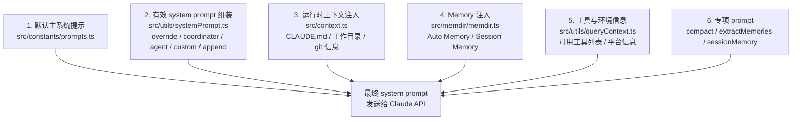

# 第 9 章：Prompt 管理机制

## 本章信息

| | |
|--|--|
| **本章目标** | 理解 Claude Code 六层分层 Prompt 组装体系的实现 |
| **适合读者** | 希望理解或定制 Claude Code Prompt 的工程师 |
| **前置知识** | 第 3 章（Memory 机制）、第 1 章（架构） |
| **核心结论** | Prompt 是"分层拼装、可缓存、可覆盖、可观测"的系统，不是固定字符串 |

---

## 核心结论

**Claude Code 的 Prompt 不是一段固定字符串，而是一套分层拼装、可缓存、可覆盖、可观测的管理系统。**

核心问题：默认 system prompt 从哪来，自定义如何覆盖，运行时上下文如何注入，以及 compact/memory 这些专项 prompt 如何并存。

---

## 六层 Prompt 架构



---

## 第一层：默认主系统提示

**文件**：`src/constants/prompts.ts`

包含 Claude Code 的基础能力描述、行为规范、工具使用说明等。这是所有对话的基础。

关键特性：
- 描述模型的角色和能力边界
- 定义工具调用的格式要求
- 包含安全和行为约束

---

## 第二层：有效 system prompt 组装器

**文件**：`src/utils/systemPrompt.ts`

组装器支持五种覆盖/叠加模式：

```typescript
export function buildEffectiveSystemPrompt(
  options: SystemPromptOptions
): string {
  // override: 完全替换默认 prompt（危险，慎用）
  if (options.override) return options.override

  // coordinator: coordinator agent 的专用 prompt
  if (options.isCoordinator) return buildCoordinatorPrompt(...)

  // agent: 自定义 agent 的专用 prompt（基于 agent 定义文件）
  if (options.agentDef) return buildAgentPrompt(options.agentDef, ...)

  // 默认路径：拼接标准提示
  let prompt = DEFAULT_SYSTEM_PROMPT

  // custom: 在默认提示后插入用户自定义内容
  if (options.customSystemPrompt) {
    prompt = insertCustomSection(prompt, options.customSystemPrompt)
  }

  // append: 追加到末尾（最常用的扩展方式）
  if (options.appendSystemPrompt) {
    prompt = prompt + '\n\n' + options.appendSystemPrompt
  }

  return prompt
}
```

---

## 第三层：运行时上下文注入

**文件**：`src/context.ts`、`src/utils/queryContext.ts`

运行时注入的内容不在 `prompts.ts` 中，而是每次 query 时动态生成：

| 注入内容 | 来源 | 说明 |
|---------|------|------|
| `CLAUDE.md` 内容 | `src/utils/claudemd.ts` | 分级信任（Managed/User/Project/Local） |
| 工作目录信息 | `setup.ts` | 当前 CWD 路径 |
| Git 状态 | `git status/log` | 当前仓库状态摘要 |
| 平台/环境信息 | `os.platform()` | macOS/Linux/Windows 等 |
| 时间戳 | `new Date()` | 当前时间（防止模型时间幻觉） |

---

## 第四层：Memory 注入

**文件**：`src/memdir/memdir.ts`

每轮对话开始前，通过 `buildMemoryPrompt()` 把 Memory 内容注入到 system prompt：

```
## MEMORY.md

[MEMORY.md 索引内容（硬截断至 200 行）]

## coding-preferences.md

[相关 topic memory 文件内容]
```

注入位置通常在 system prompt 末尾，作为"关于用户的背景信息"。

---

## 第五层：工具与环境信息

**文件**：`src/utils/queryContext.ts`

每次 query 时，系统将可用工具列表及环境信息追加到 system prompt 或 context 中：

```typescript
export function buildQueryContext(options: QueryOptions): QueryContext {
  return {
    availableTools: options.tools.map(t => ({
      name: t.name,
      description: t.description,
      inputSchema: t.inputSchema,
    })),
    platform: process.platform,
    shellType: detectShell(),
    // ...
  }
}
```

---

## 第六层：专项 Prompt

这类 Prompt 与主 system prompt 并存，用于特定的后台任务：

| 专项 Prompt | 文件 | 用途 |
|------------|------|------|
| Compact Prompt | `src/services/compact/prompt.ts` | 指导模型压缩历史对话 |
| Session Memory Prompt | `src/services/SessionMemory/prompts.ts` | 指导模型更新当前会话摘要 |
| Extract Memories Prompt | `src/services/extractMemories/prompts.ts` | 指导 fork agent 提炼 Memory 条目 |

这些专项任务通过 **fork 独立 agent** 执行，不污染主对话线程的 Prompt 状态。

---

## Prompt 缓存（Prompt Caching）

**文件**：`src/services/api/claude.ts`

Claude API 支持对 system prompt 做缓存标记，避免每次请求都重新计算固定内容的 token：

```typescript
// 发送时添加缓存标记
const systemWithCacheBreakpoints = addCacheBreakpoints(systemPrompt, {
  breakAfterSection: 'memory',  // Memory 注入后的位置添加缓存断点
})
```

缓存断点策略：将动态部分（每轮变化的对话历史）放在静态部分（system prompt）之后，最大化缓存命中率。

---

## Prompt 观测：`--dump-system-prompt`

**文件**：`src/services/api/dumpPrompts.ts`

通过命令行参数 `--dump-system-prompt` 可以输出实际发送给模型的完整 system prompt，便于调试和审计：

```bash
claude --dump-system-prompt > system-prompt.txt
```

这是 Prompt 系统"可观测"设计的体现。

---

## 本章小结

Claude Code Prompt 管理的工程价值：

1. **分层设计**：六层各司其职，覆盖基础行为、运行时上下文、用户定制、Memory 注入
2. **覆盖灵活性**：从 append（轻度）到 override（完全替换）的多种定制路径
3. **缓存优化**：缓存断点最大化静态内容复用
4. **可观测**：`--dump-system-prompt` 支持 Prompt 完全可见
5. **专项隔离**：compact / memory 专项 Prompt 通过 fork agent 执行，不污染主 Prompt

## 关键源码位置

| 文件 | 职责 |
|------|------|
| `src/constants/prompts.ts` | 默认主系统提示 |
| `src/utils/systemPrompt.ts` | 有效 system prompt 组装 |
| `src/context.ts` | 运行时上下文注入 |
| `src/utils/queryContext.ts` | 工具与环境信息 |
| `src/services/compact/prompt.ts` | Compact 专项 prompt |
| `src/services/api/dumpPrompts.ts` | Prompt 输出工具 |

## 下一步阅读建议

- [第 8 章：Context 管理](/chapters/08-context) — 上下文窗口与压缩机制
- [第 3 章：Agent Memory](/chapters/03-agent-memory) — Memory 内容如何注入
- [Prompt 组装流程图](/diagrams/memory-flow)
