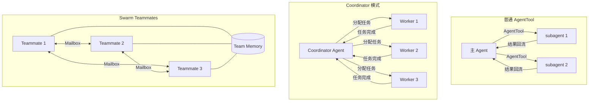

# 第 10 章：Multi-Agent 架构

## 本章信息

| | |
|--|--|
| **本章目标** | 理解 Claude Code 三套并存的 Multi-Agent 运行模型及其源码实现 |
| **适合读者** | 研究 Agent 协作架构的工程师 |
| **前置知识** | 第 3 章（Memory）、第 5 章（Tool Call） |
| **核心结论** | Claude Code 有三套并存的 Multi-Agent 模型：普通 subagent / coordinator 模式 / swarm teammates，而非单一实现 |

---

## 核心结论

**Claude Code 的 Multi-Agent 不是单一实现，而是三套并存的协作模型**，各自适用不同的协作场景：

```
一、普通 AgentTool 子代理：
   单个主 agent 派出 subagent，负责执行特定子任务

二、coordinator → workers 协调模式：
   coordinator agent 统一接收任务、分配给 worker agents

三、swarm teammates 团队协作：
   多个平等 agent 通过 mailbox 通信，共享 memory 和 task list
```

---

## 三套模型全景



---

## 第一套：普通 AgentTool 子代理

**文件**：`src/tools/AgentTool/AgentTool.tsx`、`src/tools/AgentTool/runAgent.ts`

### AgentTool 的三种执行方式

```typescript
// src/tools/AgentTool/AgentTool.tsx
type AgentExecutionMode =
  | 'sync'        // 同步：主 agent 等待子 agent 完成
  | 'background'  // 后台：主 agent 继续，子 agent 后台运行
  | 'fork'        // Fork：独立会话，有自己的 transcript
```

### 普通 subagent 执行流

```typescript
// src/tools/AgentTool/forkSubagent.ts
export async function forkSubagent(
  agentInput: AgentInput,
  ctx: ToolUseContext,
): AsyncGenerator<ToolOutput> {
  // 1. 继承主 agent 的工具池（可限制）
  const subagentTools = filterToolsForSubagent(ctx.tools, agentInput.allowedTools)

  // 2. 创建独立 QueryEngine 实例
  const subagentEngine = new QueryEngine({
    tools: subagentTools,
    systemPrompt: buildSubagentSystemPrompt(agentInput),
  })

  // 3. 执行并 yield 进度（实时流式返回）
  for await (const event of subagentEngine.query(agentInput.prompt)) {
    yield { type: 'progress', event }
  }

  // 4. 返回结果给主 agent
  yield { type: 'result', output: subagentEngine.finalResult }
}
```

---

## 第二套：Coordinator 模式

**文件**：`src/coordinator/coordinatorMode.ts`

Coordinator 模式是对普通 subagent 的增强，专门设计为"任务调度中心"角色：

```typescript
// coordinator 的专用 system prompt 注入
function buildCoordinatorPrompt(agentDefs: AgentDefinition[]): string {
  return `${BASE_COORDINATOR_PROMPT}

你是一个任务协调者（coordinator）。你的职责是：
1. 分析复杂任务，将其拆解为子任务
2. 为每个子任务选择合适的 worker agent
3. 等待并汇总 worker 的结果
4. 处理错误和重试

可用的 worker agents：
${agentDefs.map(a => `- ${a.name}: ${a.description}`).join('\n')}
`
}
```

**与普通 subagent 的区别**：
- 有专用的 coordinator system prompt
- 可以并发调度多个 worker（普通 subagent 默认串行）
- 内置任务重试和失败处理逻辑

---

## 第三套：Swarm Teammates 团队协作

**文件**：`src/utils/swarm/`、`src/tasks/InProcessTeammateTask/`

这是最复杂的多 agent 模型，支持真正的"平等协作"而非主从关系。

### Swarm Backend 注册表

```typescript
// src/utils/swarm/backends/registry.ts
const BACKEND_REGISTRY = {
  'in-process': InProcessBackend,   // 单进程内多 agent（最常用）
  'tmux':       TmuxBackend,        // 每个 agent 一个 tmux 窗格
  'iterm2':     ITerm2PaneBackend,  // 每个 agent 一个 iTerm2 面板
}
```

### Mailbox 通信机制

**文件**：`src/utils/teammateMailbox.ts`、`src/hooks/useInboxPoller.ts`

```
Teammate A                    Teammate B
    │                             │
    ├─> SendMessageTool ──────────┤  发送消息
    │                             │
    │                        InboxPoller ─> 轮询收件箱
    │                             │
    │                        处理消息并回复
    │                             │
    │<─────────────── SendMessageTool      回复
    │
```

**关键工具**：
- `SendMessageTool`：向另一个 teammate 的 mailbox 发送消息
- `TeamCreateTool`：创建新的 swarm 团队
- `TaskCreateTool`：创建协作任务
- `TaskStopTool`：停止特定任务

### Permission Bridge

**文件**：`src/utils/swarm/leaderPermissionBridge.ts`

Swarm 中权限管理的关键：worker agent 请求危险操作时，权限决策通过 bridge 上升到 leader agent，最终由用户决定。

```
Worker 请求执行危险命令
  → 无法自动批准
  → leaderPermissionBridge.requestPermission()
  → leader agent 收到权限请求
  → 展示给用户确认
  → 结果通过 bridge 回传 worker
```

---

## AgentTool 的"普通 vs Teammate"判断

```typescript
// src/tools/AgentTool/AgentTool.tsx
export async function* callAgentTool(
  input: AgentToolInput,
  ctx: ToolUseContext
): AsyncGenerator<ToolOutput> {

  // 判断是否为 swarm teammate 模式
  if (ctx.swarmConfig && input.teammateId) {
    // 启动为 swarm teammate
    return yield* spawnMultiAgent(input, ctx.swarmConfig)
  }

  // 否则作为普通 subagent 执行
  return yield* forkSubagent(input, ctx)
}
```

---

## In-Process 执行模型

**文件**：`src/utils/swarm/inProcessRunner.ts`

In-Process backend 是最常用的 swarm 实现，所有 teammate 在同一 Node.js 进程中运行，共享内存：

```
主进程
  ├── Teammate 1 (QueryEngine 实例)
  ├── Teammate 2 (QueryEngine 实例)
  └── Teammate 3 (QueryEngine 实例)
         │
     Mailbox（内存队列）
```

优点：低延迟、无进程间通信开销  
缺点：一个 teammate 崩溃可能影响其他 teammate

---

## 本章小结

Claude Code 的 Multi-Agent 体系：

1. **三套模型**：普通 subagent（简单派生）/ coordinator（任务调度）/ swarm（平等协作），覆盖不同协作场景
2. **统一内核**：三套模型都基于 `QueryEngine`，复用同一套工具/权限/memory 机制
3. **mailbox 通信**：Swarm 模式下通过工具（`SendMessageTool`）实现 Agent 间消息传递
4. **权限上升**：`leaderPermissionBridge` 确保危险操作的权限决策最终由用户控制

## 关键源码位置

| 文件 | 职责 |
|------|------|
| `src/tools/AgentTool/AgentTool.tsx` | AgentTool 入口，模式判断 |
| `src/tools/AgentTool/forkSubagent.ts` | 普通 subagent 执行 |
| `src/coordinator/coordinatorMode.ts` | Coordinator 模式 |
| `src/utils/swarm/inProcessRunner.ts` | In-Process Swarm 执行 |
| `src/utils/teammateMailbox.ts` | Mailbox 通信 |
| `src/utils/swarm/leaderPermissionBridge.ts` | 权限上升机制 |
| `src/tools/SendMessageTool/SendMessageTool.ts` | Agent 间消息发送 |

## 下一步阅读建议

- [第 12 章：程序架构亮点](/chapters/12-program-architecture) — 统一内核的工程价值
- [第 3 章：Agent Memory](/chapters/03-agent-memory) — Team Memory 在 Swarm 中的作用
- [Agent 执行流程图](/diagrams/agent-flow)
