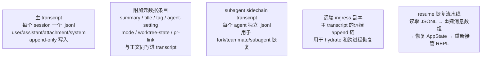
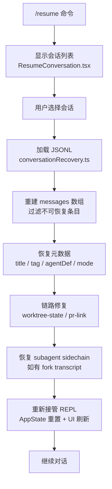

# 第 11 章：Session 持久化机制

## 本章信息

| | |
|--|--|
| **本章目标** | 理解 Claude Code 会话的 append-only 存储结构与 `/resume` 恢复流水线 |
| **适合读者** | 关注 AI 对话持久化实现的工程师 |
| **前置知识** | 第 3 章（Memory 机制） |
| **核心结论** | Claude Code 会话是 append-only JSONL 日志系统，`/resume` 经历"加载 → 元数据恢复 → 链路修复 → UI 重新接管"完整流水线 |

---

## 核心结论

**Claude Code 的会话不是"内存里聊完就算"，而是 append-only transcript 日志系统。**

`/resume` 不是简单地把旧消息数组重新塞回 REPL，而是一条完整的恢复流水线：

```
日志加载 → 元数据恢复 → 链路修复 → UI 重新接管
```

---

## 五层持久化结构



---

## Append-Only JSONL 格式

### 为什么选择 JSONL

| 属性 | 原因 |
|------|------|
| **Append-only** | 无需加锁，并发写入安全 |
| **JSONL**（每行一个 JSON） | 支持流式读取，崩溃时不丢失已写入数据 |
| **不可变历史** | 崩溃恢复后仍能重建完整会话 |

### 消息类型

```typescript
// transcript 中的条目类型
type TranscriptEntry =
  | { type: 'user';      message: UserMessage }
  | { type: 'assistant'; message: AssistantMessage }
  | { type: 'system';    message: SystemMessage }
  | { type: 'attachment'; content: AttachmentContent }
  // 元数据条目（与正文同格式写入）
  | { type: 'summary';        content: string }
  | { type: 'custom-title';   title: string }
  | { type: 'tag';            tag: string }
  | { type: 'agent-setting';  agentDef: AgentDefinition }
  | { type: 'mode';           permissionMode: PermissionMode }
  | { type: 'worktree-state'; worktreeInfo: WorktreeInfo }
  | { type: 'pr-link';        prUrl: string }
```

**元数据设计亮点**：会话标题、标签、工具模式等元数据和正文消息用**同一格式**写入 transcript，不需要独立的元数据存储，简化了恢复逻辑。

---

## 写入流程

**文件**：`src/utils/sessionStorage.ts`

```typescript
// 每次对话产生新消息时
async function appendToTranscript(
  sessionId: string,
  entry: TranscriptEntry
): Promise<void> {
  const filePath = getTranscriptPath(sessionId)
  const line = JSON.stringify(entry) + '\n'
  // append-only 写入，无需加锁
  await fs.appendFile(filePath, line, { encoding: 'utf-8' })
}
```

**存储位置**：
```
~/.claude/projects/{project-hash}/
  {session-id}.jsonl      # 主 transcript
  agents/
    {agent-id}.jsonl      # subagent sidechain
```

---

## 哪些内容不进 Transcript

并非所有内容都写入 transcript：

| 不写入的内容 | 原因 |
|------------|------|
| 工具执行中间状态（progress） | 太频繁，空间浪费 |
| Stream 中的部分 token | 只写最终完整消息 |
| sandbox 内部日志 | 内部实现细节 |
| Auto-compact 过程消息 | compact 后的摘要才写入 |

---

## `/resume` 恢复流水线

**文件**：`src/utils/conversationRecovery.ts`、`src/screens/ResumeConversation.tsx`



### 关键恢复步骤详解

**Step 1：加载 JSONL**
```typescript
// src/utils/conversationRecovery.ts
async function loadTranscript(sessionId: string): Promise<TranscriptEntry[]> {
  const filePath = getTranscriptPath(sessionId)
  const content = await fs.readFile(filePath, 'utf-8')
  return content
    .split('\n')
    .filter(line => line.trim())
    .map(line => JSON.parse(line))
}
```

**Step 2：重建消息数组**
```typescript
// 过滤元数据条目，只保留对话消息
const messages = entries
  .filter(e => ['user', 'assistant', 'system'].includes(e.type))
  .map(e => e.message)
```

**Step 3：元数据恢复**
```typescript
// 单独收集元数据条目
const metadata = {
  title: entries.findLast(e => e.type === 'custom-title')?.title,
  tags:  entries.filter(e => e.type === 'tag').map(e => e.tag),
  agentDef: entries.findLast(e => e.type === 'agent-setting')?.agentDef,
  mode: entries.findLast(e => e.type === 'mode')?.permissionMode,
}
```

---

## 远端 Ingress 副本

**文件**：`src/services/api/sessionIngress.ts`

主 transcript 的远端副本链，用于：
- 跨设备会话恢复（未来能力）
- 进程崩溃后的 hydrate
- 子 agent 在不同进程中的恢复

---

## 配置与控制

| 配置项 | 说明 | 默认值 |
|-------|------|--------|
| `cleanupPeriodDays` | transcript 保留天数 | 非零（持续积累） |
| `--no-session-persistence` | CLI 参数，关闭持久化 | 关闭 |
| `cleanupPeriodDays: 0` | 停止保留并清理已有记录 | - |

---

## 本章小结

Claude Code 的会话持久化工程价值：

1. **Append-only**：不覆盖，不加锁，崩溃安全
2. **元数据同轨**：title/tag/mode 等元数据与正文用同格式写入，无独立存储
3. **分层 sidechain**：subagent 有独立 transcript，主会话 `/resume` 时可选择性恢复子 agent
4. **完整流水线**：`/resume` 不只是"加载消息"，还包含链路修复和 UI 状态完整重建

## 关键源码位置

| 文件 | 职责 |
|------|------|
| `src/utils/sessionStorage.ts` | 主 transcript 读写 |
| `src/utils/sessionStoragePortable.ts` | 跨平台存储适配 |
| `src/utils/conversationRecovery.ts` | 恢复流水线核心 |
| `src/screens/ResumeConversation.tsx` | 会话选择 UI |
| `src/services/api/sessionIngress.ts` | 远端 ingress |

## 下一步阅读建议

- [第 8 章：Context 管理](/chapters/08-context) — compact 与 transcript 的关系
- [第 3 章：Agent Memory](/chapters/03-agent-memory) — Memory 与 Transcript 的区别
