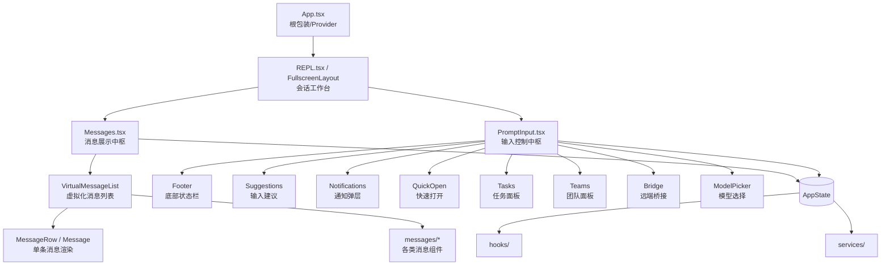

# 组件总览与分层

## 本章信息

| | |
|--|--|
| **本章目标** | 理解 Claude Code TUI 组件体系的分层结构与双中枢设计 |
| **适合读者** | 希望理解 Ink/React TUI 组件设计的开发者 |
| **前置知识** | 第 1 章（TUI 与状态层） |
| **核心结论** | 组件体系以 Messages + PromptInput 为双中枢，而非简单的"聊天界面" |

---

## 核心结论

Claude Code 的组件体系不是"页面 + 若干按钮"的前端结构，而是一个围绕**终端 Agent 工作台**组织起来的 TUI 组件平台。

**真正的双中枢**：

- `src/components/Messages.tsx`：负责"展示已经发生了什么"
- `src/components/PromptInput/PromptInput.tsx`：负责"组织下一步要做什么"

---

## 组件主干图



---

## 四层组件分类

### 第一层：Provider 与根包装层

**根组件**：`src/components/App.tsx`

职责：挂载全局上下文，而非 UI 渲染。

- `AppState.tsx`：全局状态仓库（消息、权限、MCP 等约 20 个字段）
- `context/stats.tsx`：统计上下文
- `context/fpsMetrics.tsx`：渲染性能度量

这个层级说明组件树一开始就不是"无状态展示树"，而是带运行时状态的工作台树。

### 第二层：会话工作台层

**核心组件**：`src/screens/REPL.tsx`（或 `FullscreenLayout`）

职责：维护完整的 `AppState`，编排 Messages 和 PromptInput。

包含：
- 消息历史管理
- 工具执行状态
- 权限弹窗管理
- 任务队列
- 远端状态

### 第三层：能力弹层与能力面板

从 PromptInput 展开的各种功能面板：

| 组件 | 功能 |
|------|------|
| `QuickOpen` | 文件/命令快速搜索 |
| `Search` | 全局搜索 |
| `Tasks` | 后台任务管理面板 |
| `Teams` | Swarm 团队面板 |
| `Bridge` | 远端 Bridge 状态 |
| `ModelPicker` | 运行时切换模型 |
| `MemoryFileSelector` | Memory 文件管理 |

### 第四层：services / state / hooks / tools / tasks

消息链路和输入链路的最终归宿，负责实际的数据获取和业务逻辑。

---

## 消息展示链路

```
Messages.tsx
  └── VirtualMessageList（虚拟化，仅渲染可见消息）
        └── MessageRow（每行消息容器）
              └── Message（具体消息内容）
                    ├── UserMessage（用户输入）
                    ├── AssistantMessage（AI 回复）
                    ├── ToolUseMessage（工具调用展示）
                    ├── ToolResultMessage（工具结果）
                    └── SystemMessage（系统通知）
```

**虚拟化设计**：长会话时只渲染当前可见的消息，避免大量 DOM 节点占用内存。这在 Ink（终端渲染）场景下尤为重要。

---

## 输入控制链路

```
PromptInput.tsx
  ├── 文本输入区（多行编辑）
  ├── Suggestions（基于历史和上下文的输入建议）
  ├── 附件处理（图片、文件拖拽）
  ├── 斜杠命令（/ 触发）
  └── 提交处理（Enter → query.ts）
```

---

## AppState 共享状态

`AppState` 不只是 UI 状态，而是系统的共享数据总线：

```typescript
type AppState = {
  messages:              Message[]
  toolPermissionContext: ToolPermissionContext
  mainLoopModel:         string
  mcpClients:            McpClient[]
  plugins:               Plugin[]
  agentRegistry:         AgentDefinition[]
  notifications:         NotificationQueue
  remoteBridgeState:     BridgeState | null
  tasks:                 Task[]
  teammates:             Teammate[]
  // ... 还有约 20 个字段
}
```

---

## 本章小结

组件体系的关键设计理念：

1. **双中枢**：Messages（展示）+ PromptInput（输入），两者都依赖 AppState
2. **虚拟化**：消息列表虚拟化，支持长会话不卡顿
3. **弹层化**：复杂功能通过能力弹层从 PromptInput 展开，保持主界面简洁
4. **状态总线**：AppState 是系统级状态，不只是 UI 状态

## 关键源码位置

| 文件 | 职责 |
|------|------|
| `src/components/App.tsx` | 根组件，Provider 层 |
| `src/screens/REPL.tsx` | 会话工作台，AppState 维护 |
| `src/components/Messages.tsx` | 消息展示中枢 |
| `src/components/PromptInput/PromptInput.tsx` | 输入控制中枢 |
| `src/state/AppStateStore.ts` | 状态管理实现 |

## 下一步阅读建议

- [核心交互组件](/components/interaction-components) — Messages 与 PromptInput 详细实现
- [平台能力组件](/components/platform-components) — 各种能力弹层详解
