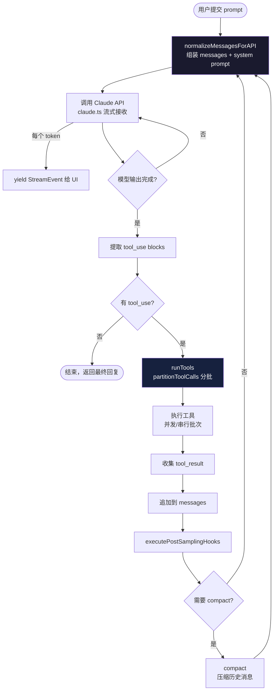
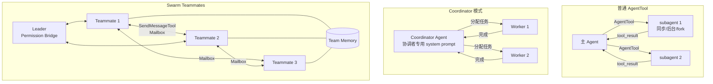
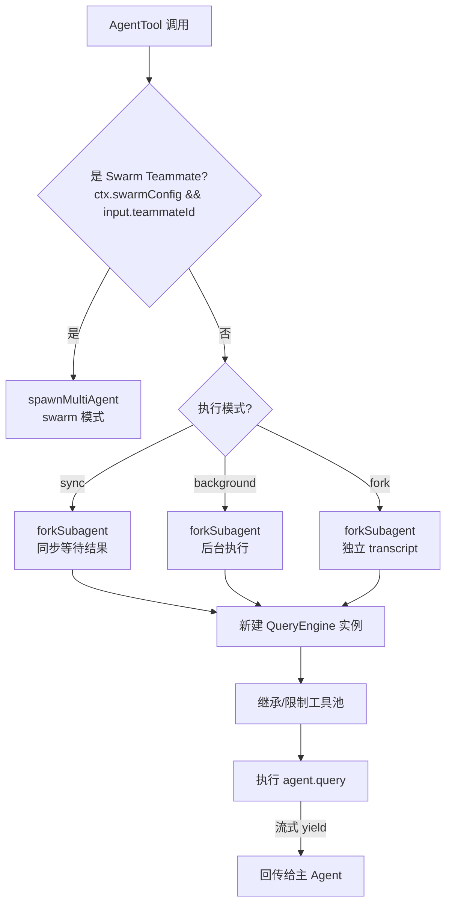
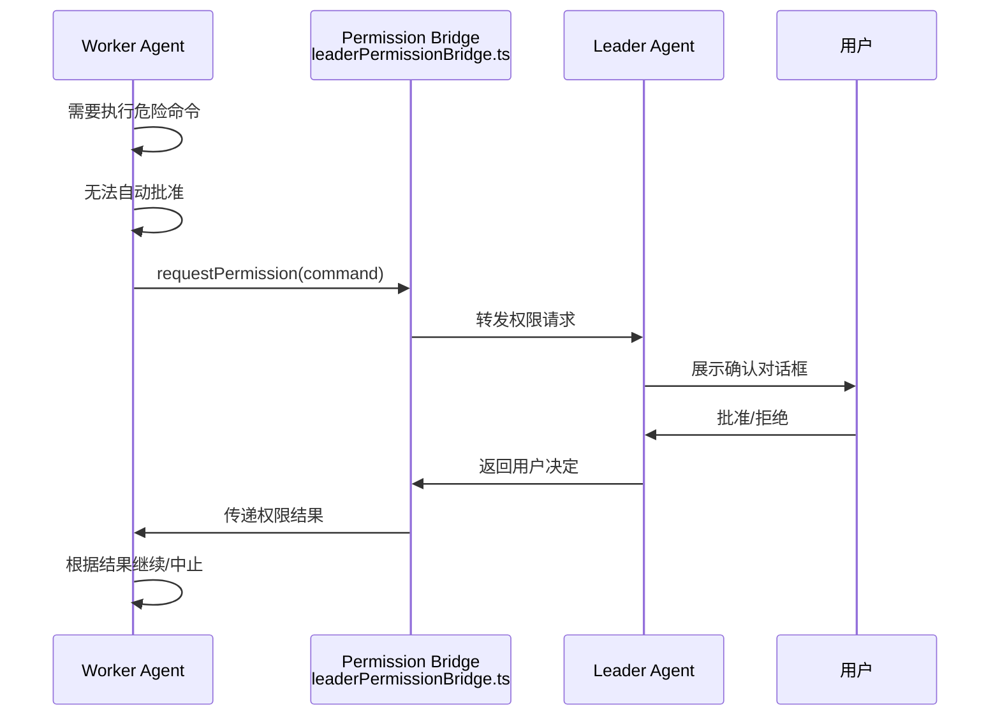

# 流程图：Agent 执行流程

---

## 图 1：query.ts 主循环流程

---

## 图 2：三套 Multi-Agent 模型

---

## 图 3：AgentTool 执行决策

---

## 图 4：Swarm Permission Bridge

---

## 相关阅读

- [第 10 章：Multi-Agent 架构](/chapters/10-multi-agent)
- [第 5 章：Tool Call 实现](/chapters/05-tool-call)
- [第 1 章：总体架构](/chapters/01-architecture-entry)
