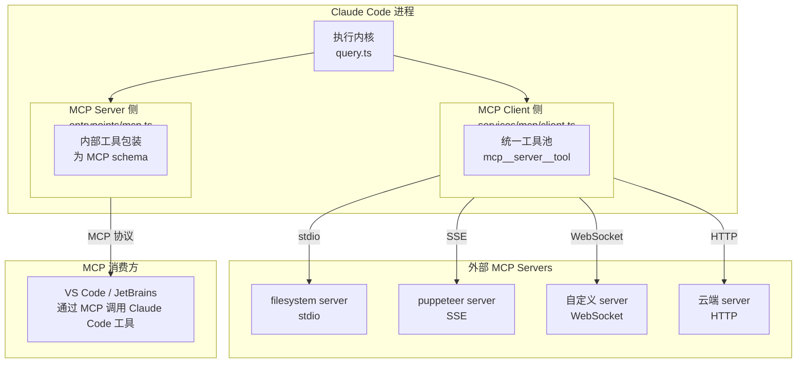
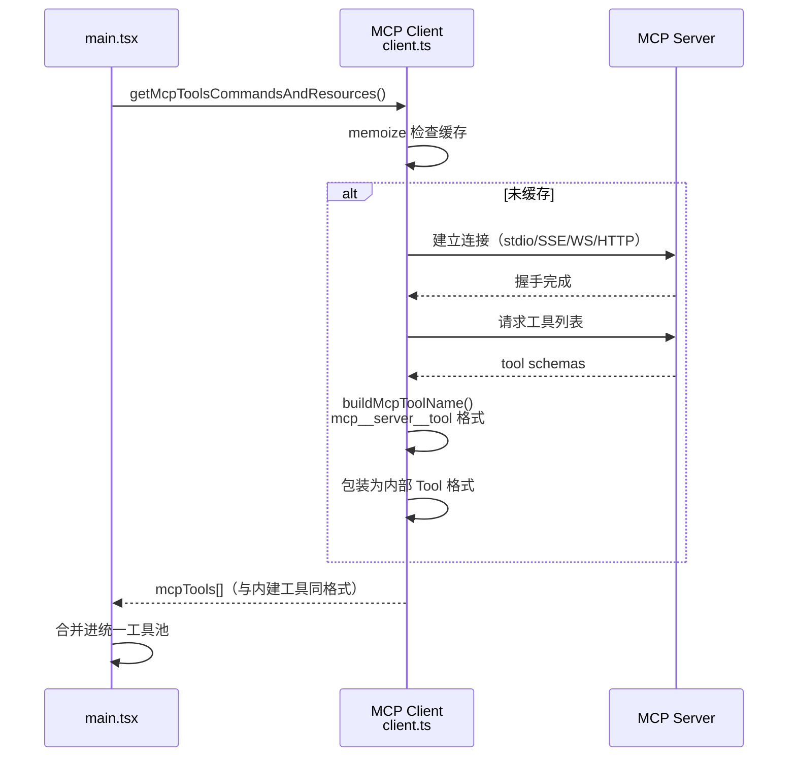
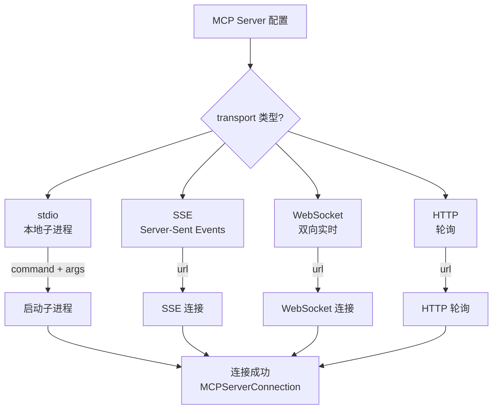
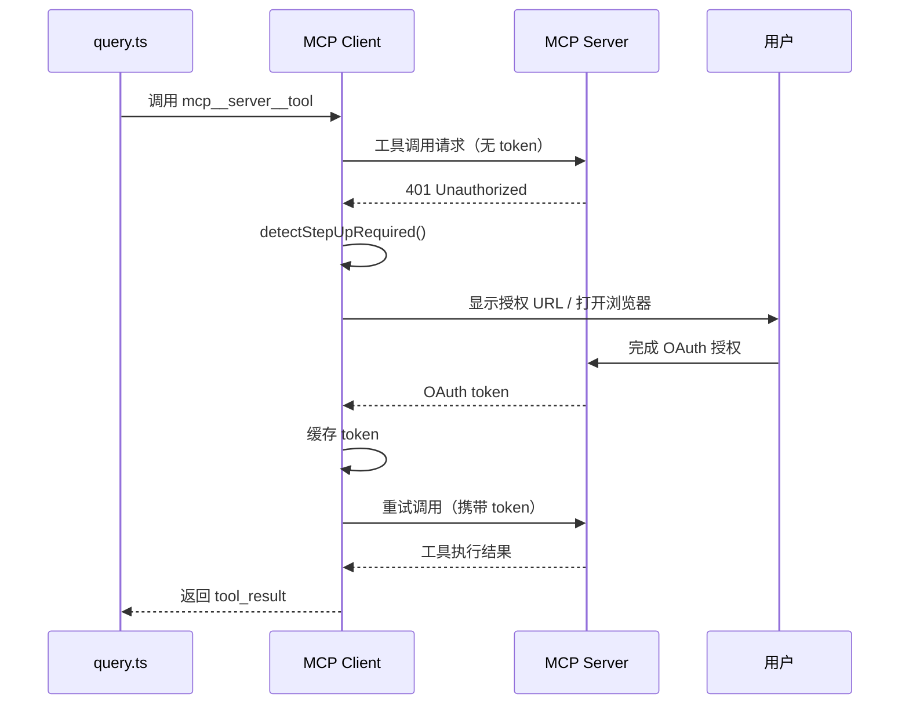
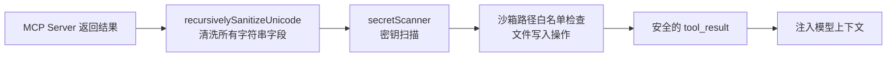

# 流程图：MCP 集成流程

---

## 图 1：MCP 双向架构

---

## 图 2：MCP 连接建立流程

---

## 图 3：四种传输协议选择

---

## 图 4：OAuth Step-up 认证流程

---

## 图 5：MCP 安全过滤

---

## 相关阅读

- [第 6 章：MCP 集成机制](/chapters/06-mcp)
- [第 5 章：Tool Call 实现](/chapters/05-tool-call)
- [第 2 章：安全分析（MCP 不可信输入防御）](/chapters/02-security-info-collection)
