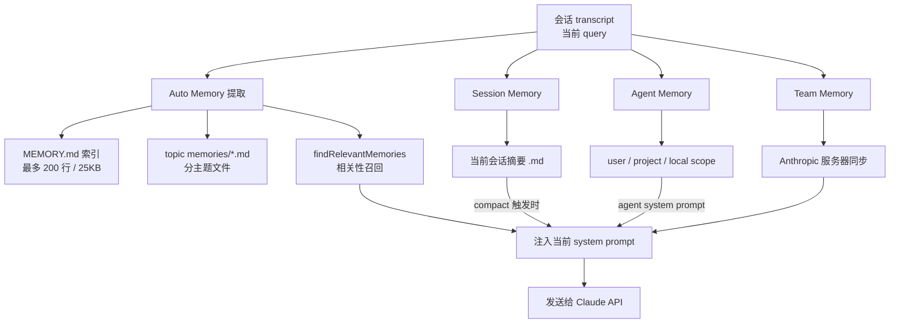
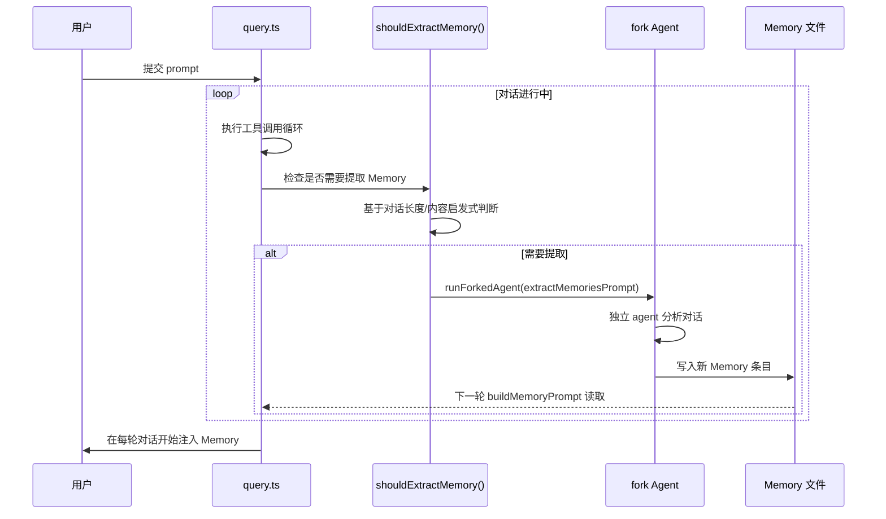
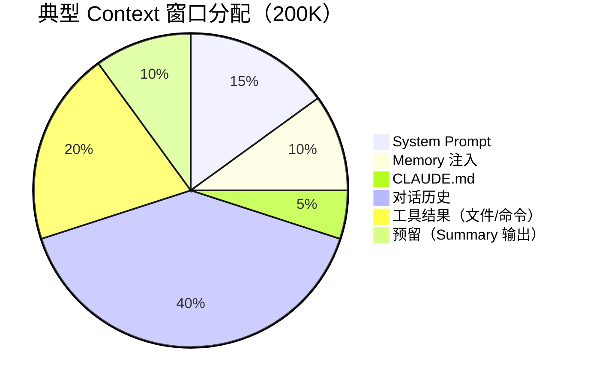
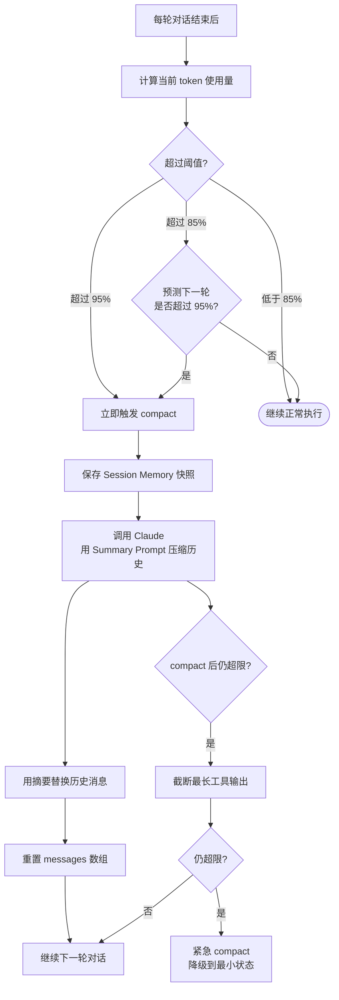
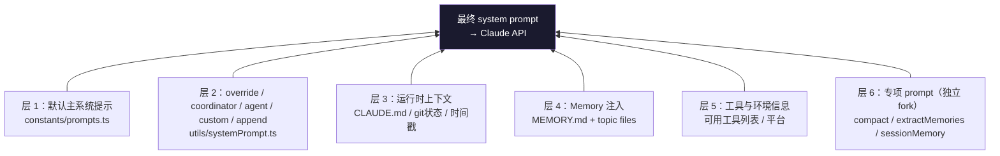

# 流程图：Memory 与 Context 管理流程

---

## 图 1：Memory 系统总览

---

## 图 2：Auto Memory 提取时机

---

## 图 3：Context 窗口分配

---

## 图 4：Auto-Compact 触发与执行

---

## 图 5：Prompt 六层组装

---

## 相关阅读

- [第 3 章：Agent Memory 机制](/chapters/03-agent-memory)
- [第 8 章：Context 上下文管理](/chapters/08-context)
- [第 9 章：Prompt 管理机制](/chapters/09-prompt)
