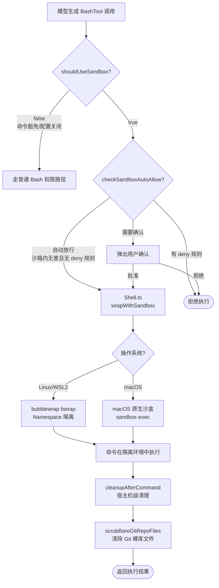
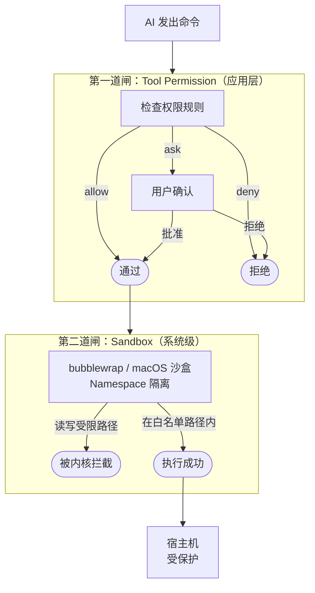
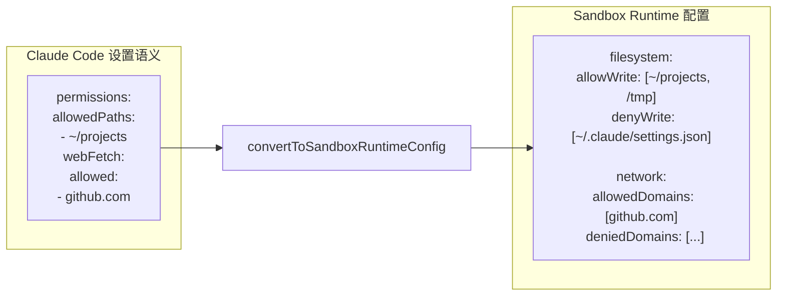
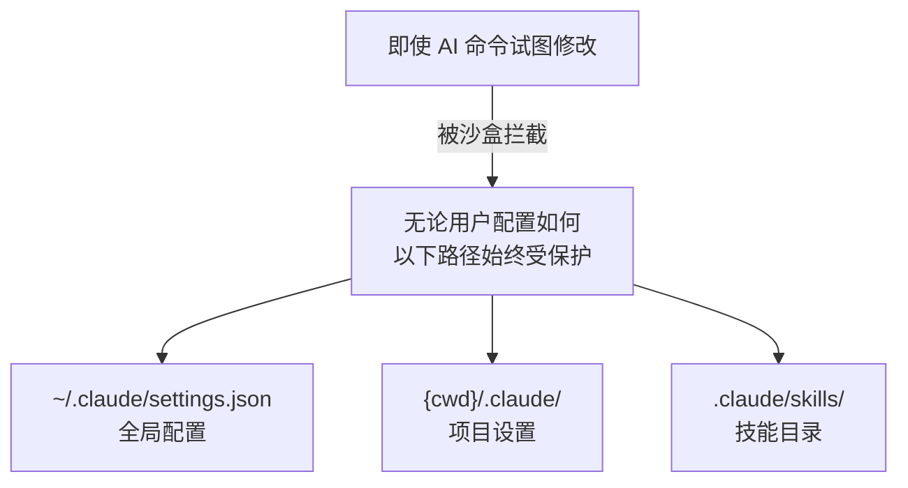
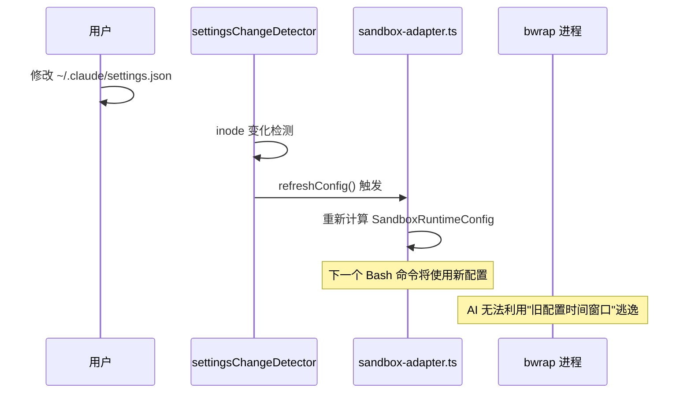

# 流程图：Sandbox 权限控制流程

---

## 图 1：Sandbox 四层执行链

---

## 图 2：双重权限闸架构

---

## 图 3：SandboxRuntimeConfig 配置翻译

---

## 图 4：内置路径保护

---

## 图 5：热更新同步时序

---

## 相关阅读

- [第 7 章：Sandbox 沙盒机制](/chapters/07-sandbox)
- [第 2 章：安全分析（双重权限闸）](/chapters/02-security-info-collection)
