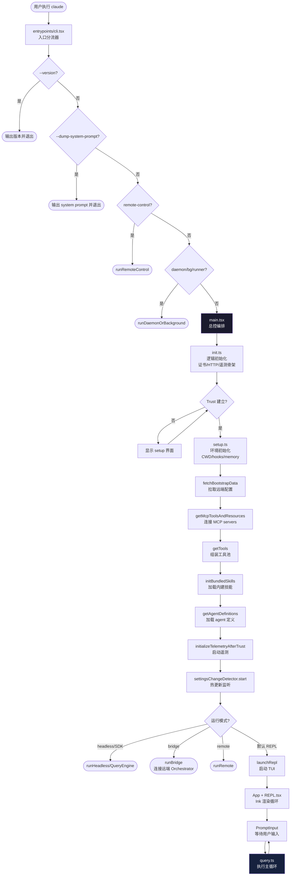
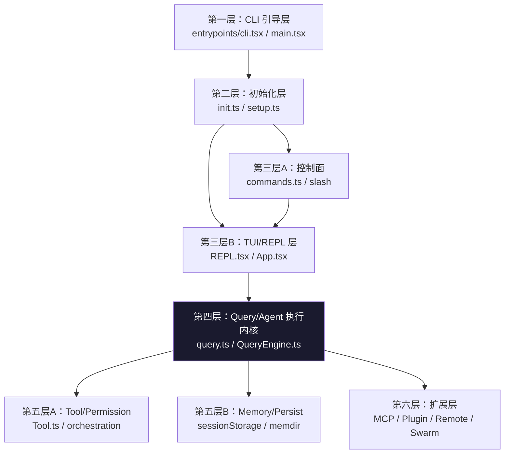
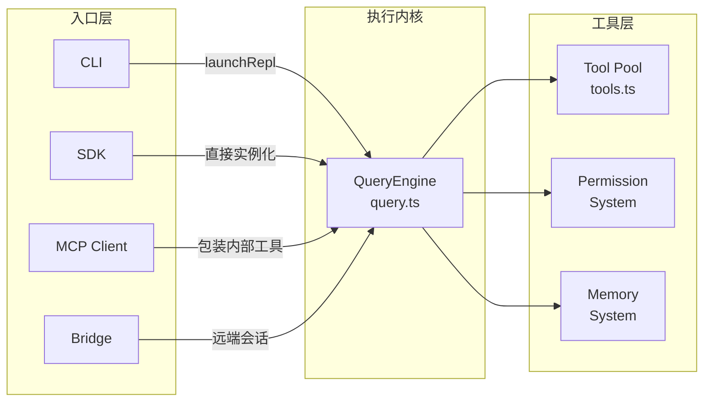
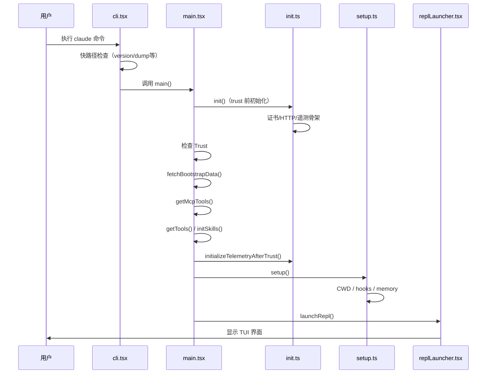

# 流程图：CLI 启动流程

本页包含 Claude Code 启动链路的 Mermaid 可视化图表。

---

## 图 1：CLI 总体启动流程

---

## 图 2：六层架构分层图

---

## 图 3：四种运行形态

---

## 图 4：初始化时序图

---

## 相关阅读

- [第 1 章：软件架构与程序入口](/chapters/01-architecture-entry)
- [第 12 章：程序架构亮点](/chapters/12-program-architecture)
