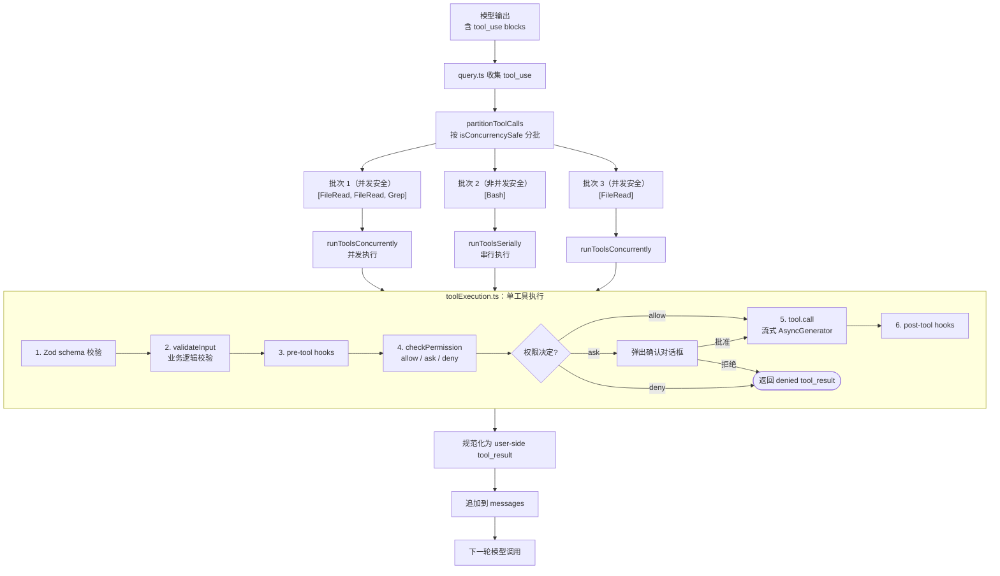
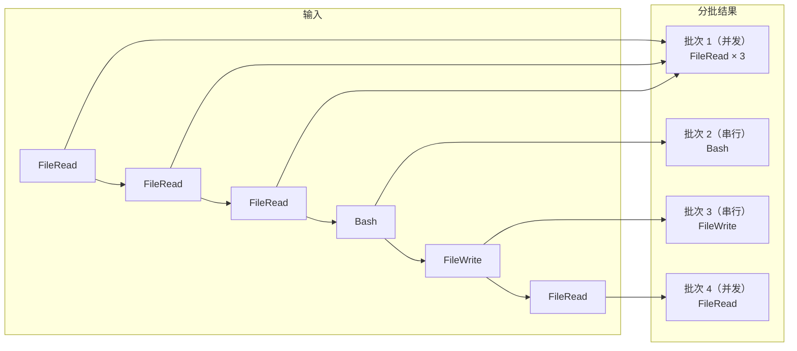
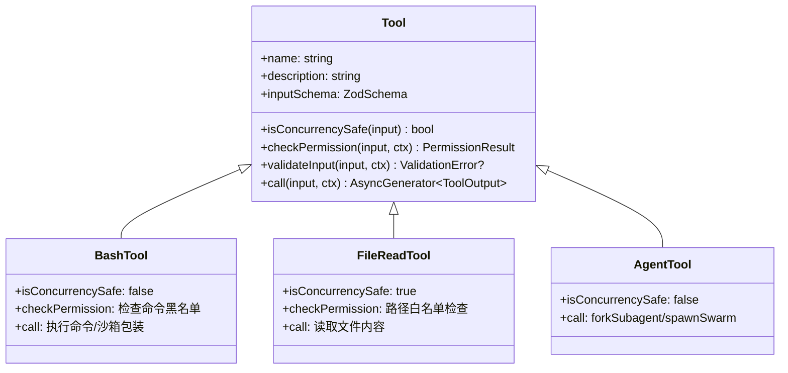
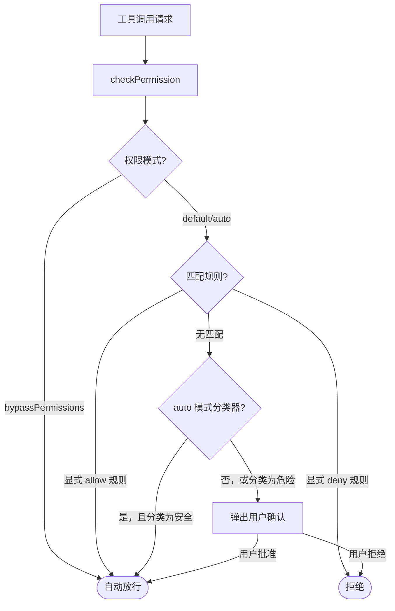

# 流程图：Tool Call 调用流程

---

## 图 1：Tool Call 完整执行链

---

## 图 2：并发分批示意

---

## 图 3：Tool 接口结构

---

## 图 4：权限判断流程

---

## 相关阅读

- [第 5 章：Tool Call 实现](/chapters/05-tool-call)
- [第 7 章：Sandbox](/chapters/07-sandbox)
- [第 2 章：安全分析（权限模式分级）](/chapters/02-security-info-collection)
