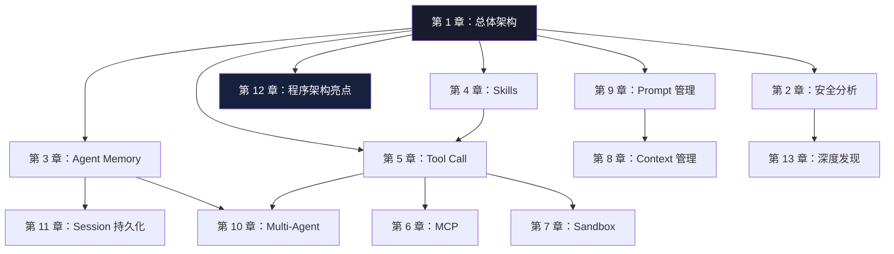

# 阅读路线图

## 全局依赖关系



## 三条阅读路线

### 路线 A：快速了解（2 小时）

适合：想快速形成整体认知，不深入细节。

```
架构总览 → 第 1 章 → 第 18 章（总结）→ 第 2 章（安全概览）
```

1. 先读 [架构总览](/guide/architecture-overview)，建立基本心智模型
2. 读 [第 1 章](/chapters/01-architecture-entry)，理解六层分层与启动链路
3. 跳到 [第 18 章](/chapters/18-summary) 看结论
4. 按兴趣选读 [安全分析](/chapters/02-security-info-collection) 或 [Multi-Agent](/chapters/10-multi-agent)

### 路线 B：系统精读（1~2 天）

适合：AI 工程师、希望深入理解 Agent 平台架构的读者。

**第一阶段：打基础**

| 顺序 | 章节 | 预计时间 |
|------|------|---------|
| 1 | [架构总览](/guide/architecture-overview) | 10 分钟 |
| 2 | [第 1 章：软件架构与程序入口](/chapters/01-architecture-entry) | 30 分钟 |
| 3 | [第 12 章：程序架构亮点](/chapters/12-program-architecture) | 20 分钟 |

**第二阶段：核心机制**

| 顺序 | 章节 | 预计时间 |
|------|------|---------|
| 4 | [第 5 章：Tool Call 实现](/chapters/05-tool-call) | 40 分钟 |
| 5 | [第 3 章：Agent Memory](/chapters/03-agent-memory) | 40 分钟 |
| 6 | [第 9 章：Prompt 管理](/chapters/09-prompt) | 30 分钟 |
| 7 | [第 8 章：Context 管理](/chapters/08-context) | 30 分钟 |
| 8 | [第 10 章：Multi-Agent](/chapters/10-multi-agent) | 40 分钟 |

**第三阶段：扩展能力**

| 顺序 | 章节 | 预计时间 |
|------|------|---------|
| 9 | [第 4 章：Skills](/chapters/04-skills) | 20 分钟 |
| 10 | [第 6 章：MCP 集成](/chapters/06-mcp) | 30 分钟 |
| 11 | [第 11 章：Session 持久化](/chapters/11-session-storage) | 25 分钟 |

**第四阶段：安全与产品**

| 顺序 | 章节 | 预计时间 |
|------|------|---------|
| 12 | [第 2 章：安全分析](/chapters/02-security-info-collection) | 40 分钟 |
| 13 | [第 7 章：Sandbox](/chapters/07-sandbox) | 30 分钟 |
| 14 | [第 13 章：深度发现](/chapters/13-extra-findings) | 20 分钟 |
| 15 | [第 18 章：总结](/chapters/18-summary) | 10 分钟 |

### 路线 C：专题研究

**安全与隐私专题**

```
第 2 章 → 第 7 章 → 第 13 章 → 第 15 章
```

关注：信息收集边界、沙盒隔离原理、Trust 模型、情绪检测机制。

**Agent 工程专题**

```
第 1 章 → 第 5 章 → 第 10 章 → 第 12 章
```

关注：执行内核设计、工具调用链路、多 Agent 协作模型、统一内核的工程价值。

**LLM 上下文管理专题**

```
第 8 章 → 第 9 章 → 第 3 章 → 第 11 章
```

关注：Context 窗口分配、Prompt 分层拼装、Memory 文件化、Session 恢复流水线。

**MCP / 扩展能力专题**

```
第 4 章 → 第 6 章 → 第 1 章（5.6 节）
```

关注：Skills 文件格式、MCP 四种传输协议、双向 MCP 架构设计。

---

## 章节依赖速查

| 章节 | 建议前置阅读 |
|------|------------|
| 第 3 章：Memory | 第 1 章 5.5 节 |
| 第 5 章：Tool Call | 第 1 章 5.4 节 |
| 第 6 章：MCP | 第 5 章 |
| 第 7 章：Sandbox | 第 2 章第三节 |
| 第 8 章：Context | 第 9 章 |
| 第 10 章：Multi-Agent | 第 3 章、第 5 章 |
| 第 11 章：Session | 第 3 章 |
| 组件体系 | 第 1 章 5.2 节 |
